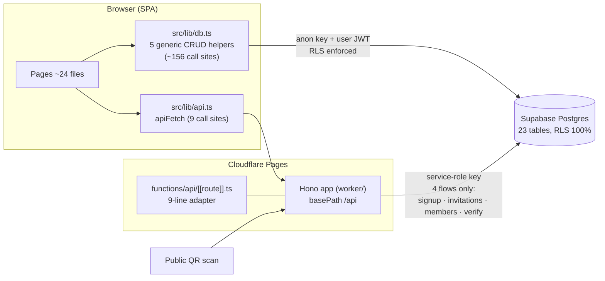
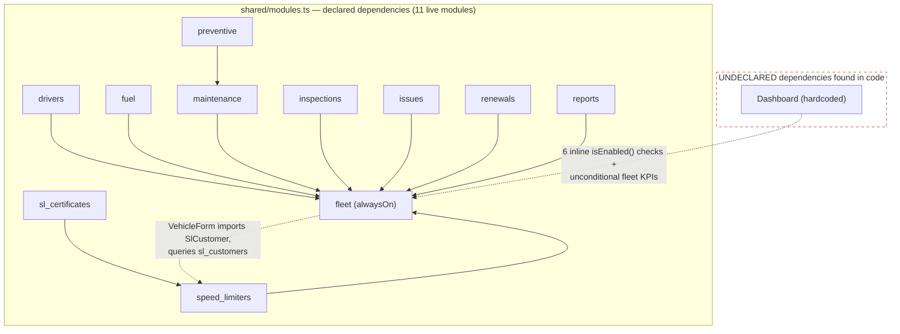
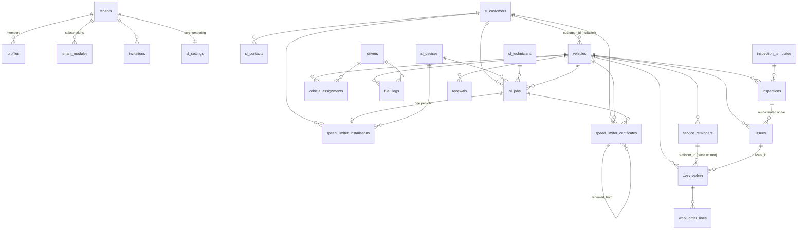
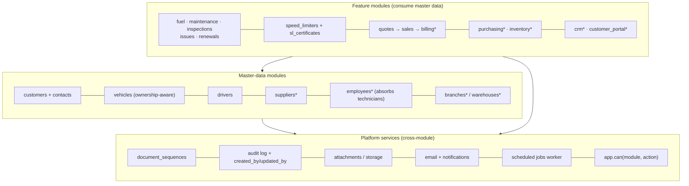

# FleetManage — Architecture Review

**Date:** 2026-07-18 · **Scope:** full-system audit (repo + live Supabase project `ugfdexoaxladblafcrlc`) ahead of the modular-enterprise-platform build-out.
**Method:** 9 parallel subsystem audits (structure, DB schema, speed-limiter suite, app shell, data/API layer, fleet modules, security/permissions, i18n/UI kit, docs/roadmap), every critical/high finding adversarially re-verified against the code, plus a completeness pass and live-DB inspection (schema, security advisors, performance advisors). No code was changed.

---

## Executive summary

FleetManage's foundation is **better than most codebases at this stage**: uniform RLS on all 23 tables with JWT-immutable tenant/role claims, a real module registry with dependency semantics and a DB-backed subscription table, compile-enforced en/ar i18n with disciplined RTL, a shared country engine, and one Hono API served identically in dev and prod. The platform vision is not a rewrite — it is a **re-layering**.

The audit **confirms both of your hypotheses**:

1. **Customers are trapped inside the Speed Limiter module.** `sl_customers` / `sl_contacts` are generic B2B master-data tables (CR number, tax number, billing terms, credit limit, contacts with departments) with *nothing* speed-limiter-specific in them — yet they are namespaced, routed (`/speed-limiters/customers`), translated (`slCustomers.*`), and typed (`SlCustomer`) as module property. The dependency is already inverted: the always-on fleet module's `VehicleForm` imports `SlCustomer` and queries `sl_customers` ([VehicleForm.tsx:6,25-30](../src/pages/vehicles/VehicleForm.tsx)), and the shared `vehicles` table FKs into `sl_customers` (`vehicles.customer_id`, [20260719000001_sl_enterprise.sql:48](../supabase/migrations/20260719000001_sl_enterprise.sql)). `docs/SPEED_LIMITERS.md` even plans for future Finance/Inventory to build on these module-scoped tables — cementing the inversion.
2. **The fake ownership dropdown exists verbatim.** `<option value="">— Own fleet —</option>` at [VehicleForm.tsx:152](../src/pages/vehicles/VehicleForm.tsx) encodes ownership as "NULL customer_id = own fleet". No `ownership_type` exists, and **every fleet surface is blind to it**: customer-owned vehicles are counted in "X vehicles in fleet", appear in all fuel/maintenance/renewals pickers, and pollute cost reports and dashboard KPIs.

**The extraction is feasible now, cheaply, without breaking the app.** The blast radius is fully enumerated (§11–§13): 5 FK sites, ~12 SPA files, one worker endpoint, one i18n namespace. Postgres rewires FKs automatically on `ALTER TABLE RENAME`; compatibility views can keep the previously deployed bundle working during rollout. Live data volume is demo-scale (2 tenants, 3 customers, 5 vehicles), so **this is the cheapest moment the refactor will ever have**. Every week of delay adds FKs and call sites.

The three structural risks that would silently corrupt the platform if unaddressed before the next module wave:

| # | Risk | Why it matters |
|---|------|----------------|
| 1 | **Module enablement is client-side UX only** — no RLS policy or worker route consults `tenant_modules` | Paid modules have no enforcement point; any tenant member can use disabled modules via direct PostgREST calls |
| 2 | **Unpaginated `select("*")` everywhere** — PostgREST silently truncates at 1,000 rows | Reports/KPIs become silently *wrong* (not slow) for any real tenant; a service provider with 2,000 certificates sees 1,000 |
| 3 | **Fixed 4-role global permission model** + no audit trail + stale-JWT window on role change | "Technician sees jobs only", "accountant sees finance only", customer-portal logins — all unexpressible; compliance-certificate issuance has no who-did-what record |

---

## 1. Current architecture

### 1.1 Stack and topology

| Layer | Implementation |
|---|---|
| Frontend | React 19 + Vite + TypeScript (strict, project references) + Tailwind v4 + TanStack Query + React Router 7 |
| API | **One** Hono app (`worker/`, 399 lines) served three ways: Node host in dev (`scripts/dev-api.ts` @ :8788), Cloudflare Pages Function in prod (`functions/api/[[route]].ts` — a 9-line adapter), potentially a raw Worker. Zero drift between environments. |
| Data | Supabase Postgres, 23 tables, RLS on 100% of them. Browser talks to PostgREST **directly** with the anon key for all domain CRUD (~156 call sites through 5 generic helpers in `src/lib/db.ts`); the Worker handles only 4 privileged flows (signup, invitations, members, public certificate verify) with the service-role key. |
| Auth | Supabase Auth. `tenant_id` + `role` in **`app_metadata`** (user-immutable, set only by the service-role worker) — the single most important multi-tenancy decision, made correctly. |
| Shared code | `shared/countries.ts` (country engine, 16 rich ME profiles + generic fallback) and `shared/modules.ts` (module registry, 43 entries) — isomorphic, imported by both SPA and Worker, both unit-tested. |
| i18n | 18 namespaces × en+ar, `MessageKey` union type, Arabic completeness is a **compile error**. Zero physical-direction Tailwind classes in the tree (verified by grep). |
| Deploy | Cloudflare Pages Git integration; push to `main` → build → https://fleetza.pages.dev. Migrations applied via Supabase MCP + mirrored to `supabase/migrations/`. |



### 1.2 What runs where

- **Business logic in Postgres (the good kind):** atomic per-tenant certificate numbering (`next_certificate_number` RPC on an `sl_settings` counter row), transactional job completion (`complete_sl_job`: `FOR UPDATE` lock, idempotent via partial unique index, retires prior installations, moves device stock), monotonic odometer bump trigger, per-tenant work-order/job numbering triggers.
- **Business logic in page components (the fragile kind):** primary-contact uniqueness (demote-loop then insert — partial failure leaves 0 or 2 primaries), renewal recurrence seeding (read-then-insert with an in-code comment admitting staleness risk), issue→work-order dedupe, all job state transitions except completion.
- **Nothing runs on a schedule.** Pages Functions cannot have cron handlers; `wrangler.jsonc` has no triggers, there are no queues and no edge functions. All time-based logic (renewal due-soon, certificate expiry) is computed at page render. Reminders/digests are architecturally impossible today.

### 1.3 Verified strengths (keep these)

- **RLS discipline:** all 23 tables, uniform loop-generated 4-policy template, helpers wrapped in `(select …)` for initplan caching, `search_path` pinned by a hardening migration. Live security advisors: clean (only auth "leaked password protection" toggle off).
- **Privilege-escalation blocked at the column level:** `UPDATE` on `profiles` revoked and re-granted only on `full_name, phone, language` — users cannot self-promote role or hop tenants even though they can edit their own row.
- **Vehicles were *not* duplicated for the SL module** — one shared `vehicles` table serves both archetypes. The most important master-data precedent already exists.
- **`tenant_modules` exists in the DB** — modularity is a database fact, not just a frontend registry.
- **The certificate pipeline is mature:** atomic numbering, unique backstop, revocation, renewal lineage (`renewed_from` self-FK), capability-URL public verification (uuid-keyed, whitelisted fields).
- **i18n/RTL is enforced, not aspirational**, and the country engine is genuinely shared and well-tested (CLDR cross-checks, 3-decimal dinar handling).
- **Secrets hygiene:** service-role key never in repo or browser; documented sensitivity split.

---

## 2. Current module dependency diagram



The dashed edges are the architectural violations: the **always-on base module depends on an optional add-on's tables** (dependency inversion), and the dashboard is a hardcoded composition rather than a registry contribution point.

Also notable: the registry's `routes` field and its tested `moduleForPath()` resolver are **dead code** — `App.tsx` hand-wires every `<ModuleGate>` and `nav.ts` is a second hand-maintained list, so module→route→nav ownership is specified in three places that agree only by convention (and already drifted once: `/settings/*` is ungated in the router while nav files it under `fleet`).

## 3. Entity relationship analysis



Key observations (all verified against the live database):

| Finding | Evidence | Consequence |
|---|---|---|
| `vehicles.customer_id → sl_customers.id` | live FK `vehicles_customer_id_fkey` | A **global** entity depends on a **module-owned** entity — backwards |
| Ownership = one nullable column; NULL means "own fleet" (SQL comment only) | `sl_enterprise.sql:46-51` | No ownership type, no transfer history — reassigning the FK silently reattributes all history |
| Hard `ON DELETE CASCADE` from `vehicles` to *everything*, including issued certificates | `modules_speed_limiters.sql:69`, `sl_enterprise.sql:105` | Deleting one vehicle irreversibly destroys regulator-facing certificates whose QR links are in the wild |
| Single-column FKs — nothing proves a referenced row is same-tenant | all child FKs | A tenant-A manager who learns a tenant-B UUID can attach fuel logs to tenant B's vehicle (RLS passes; FK passes) |
| `work_orders.reminder_id` exists but **no code ever writes it** | grep: type declaration only | The preventive-maintenance loop (reminder → work order) is dead wiring |
| Free-text master data: `work_orders.vendor`, `fuel_logs.vendor`, `sl_devices.supplier`, `installations.technician` | init.sql:193,255; sl_enterprise.sql:66 | Purchasing/Finance need supplier entities; `complete_sl_job` actively snapshots technician *names* into new rows |
| Two numbering patterns: race-prone `max()+1` triggers (work orders, jobs) vs. correct atomic counter (certificates) | init.sql:221-240 vs. sl_fixes.sql:6-27 | Concurrent creates in one tenant → opaque unique-constraint failures; the correct pattern already exists and should be generalized |
| No soft delete, no `deleted_at`, ~6 actor columns across 23 tables, no `updated_by` anywhere, no audit table | schema-wide | "Who changed what when" is unanswerable for a compliance product |
| Missing FK indexes (~12–19, confirmed by live performance advisors) incl. `fuel_logs.vehicle_id`, `fuel_logs.driver_id`, both sides of issue↔work-order | live advisor output | Driver-360/issue pages and cascade deletes become seq scans at scale |
| One tenant per user by construction (`profiles.id` = auth user id, single JWT claim) | init.sql:72-81 | An accountant serving two fleets, or a customer-portal contact, has no place in the model |

**Nonexistent entities (greenfield — no rework needed):** suppliers, employees, branches, warehouses, quotes, invoices, payments, price lists, product catalog, audit log, attachments/documents. None appear in any migration.

## 4. Module dependency matrix

Declared (`requires:` in the registry) vs. **actual data dependencies** discovered in the audit. ● = declared, ○ = real-but-undeclared, ✗ = inverted/wrong.

| Module | fleet | drivers | maint. | speed_limiters | **customers** (doesn't exist) | **suppliers** (doesn't exist) | **employees** (doesn't exist) |
|---|:-:|:-:|:-:|:-:|:-:|:-:|:-:|
| fleet (vehicles) | — | | | **✗** (VehicleForm → sl_customers) | ○ (owner) | | |
| drivers | ● | — | | | | | |
| fuel | ● | ○ (driver_id) | | | | ○ (vendor text) | |
| maintenance | ● | | — | | | ○ (vendor text) | |
| preventive | ● | | ● | | | | |
| inspections | ● | ○ | | | | | |
| issues | ● | | ○ (WO link) | | | | |
| renewals | ● | | | | | | |
| reports | ● | ○ | ○ | | | | |
| speed_limiters | ● | | | — | ○ (sl_customers **is** the customers table) | ○ (device supplier text) | ○ (technicians ≈ employees) |
| sl_certificates | ● | | | ● | ○ | | |
| *coming: crm / sales / billing / contracts / customer_portal* | | | | | **required — blocked** | | |
| *coming: purchasing / inventory* | | | | | | **required — blocked** | ○ (warehouses too) |
| *coming: payroll_hr / workshop / dispatch* | ● | ● | ● | | | | **required — blocked** |

The registry's `requires` graph encodes UI dependencies but **no data dependencies**, and there are no master-data modules to depend on. All 8+ commerce/finance/people modules in the catalog declare `requires: []` while being hard-blocked on entities that either live inside the SL module or don't exist. This is the single clearest argument for the master-data extraction: **the catalog you're selling is unbuildable on the current entity ownership model.**

---

## 5. Problems found

93 findings were raised; every critical/high finding was independently re-verified against the code (verdicts: CONFIRMED / PARTIAL — corrected details incorporated below). Grouped by theme, worst first:

### A. Master data & ownership (the platform blockers)

| Sev | Finding | Evidence |
|---|---|---|
| CRIT | Customers/contacts/technicians locked inside SL module; fleet module depends on them (inverted) | `sl_enterprise.sql:7-44,82-92`; `VehicleForm.tsx:6,25-30` |
| CRIT | Ownership = fake `— Own fleet —` dropdown over nullable `customer_id`; every fleet surface (list, KPIs, pickers, reports) is ownership-blind | `VehicleForm.tsx:149-158`; grep: `customer_id` appears in **zero** other fleet files |
| HIGH | Docs cement the inversion: SPEED_LIMITERS.md plans Finance/Inventory on top of `sl_` tables | `docs/SPEED_LIMITERS.md:149-164` |
| MED | Suppliers/vendors/technician names are free text; `complete_sl_job` snapshots names into rows despite an FK existing | init.sql:193,255; sl_fixes.sql:88,94 |

### B. Enforcement & security

| Sev | Finding | Evidence |
|---|---|---|
| HIGH | Module enablement enforced **only in React** — no RLS policy or worker route consults `tenant_modules`; disabled modules' data fully readable/writable via direct PostgREST | ModuleGate.tsx:14-36; all sl_* policies check tenant+role only |
| HIGH | Role change / member removal never revokes live tokens — a demoted admin keeps admin RLS rights until token expiry (~1h); a removed member's JWT keeps working | members.ts:30-59 (no `signOut`) |
| HIGH | Public signup: no email verification (`email_confirm: true`), no CAPTCHA, no rate limit, on a service-role endpoint; email squatting + enumeration possible | onboarding.ts:27-46 |
| HIGH | 4 fixed global roles; no per-module/record/field permissions; 65 scattered `isManager` UI booleans; the one page-level block (`NewInspectionPage`) blocks the *field-worker* persona it should serve | AuthContext.tsx:127-134; NewInspectionPage.tsx:180 |
| HIGH | No audit trail: ~6 actor columns across 23 tables, no `updated_by`, no audit table — for a product that issues compliance certificates | schema-wide |
| MED | Cross-tenant reference pollution possible (single-column FKs) | init.sql child FKs |
| MED | Role-change write is non-atomic and its `profiles` update error is ignored → JWT and DB can disagree permanently (RLS trusts JWT; UI trusts DB row) | members.ts:35 |
| MED | No rate limiting on any public endpoint; no MFA/SSO/password policy beyond min-8; no API keys for integrations | worker/index.ts |
| LOW | Invite link is a bearer credential delivered by clipboard; invitee mailbox never proven | SettingsPage.tsx:736-739 |

### C. Data integrity & lifecycle

| Sev | Finding | Evidence |
|---|---|---|
| HIGH | Hard cascade deletes destroy issued certificates and financial history (vehicle delete → certificates, work orders, fuel history gone; public QR links break) | cascade graph from `vehicles` |
| HIGH | Job state machine enforced client-side except completion — any manager JWT can jump `scheduled → closed` via PostgREST, skipping device/installation bookkeeping | only `complete_sl_job` checks status |
| HIGH | Certificates issuable at `completed` (pre-QC), contradicting the documented QC gate; DB requires only manager role to insert a certificate (any status, null job) | JobDetailPage.tsx:396-399 vs docs/SPEED_LIMITERS.md:93-95 |
| MED | Renewal leaves the superseded certificate publicly "valid" — after renewal, a stale printed QR still scans green | CertificatesPage.tsx:104-129 |
| MED | Cert numbering RPC + insert are two requests — numbers leak on failure (audit-visible gaps in a regulated sequence) | JobDetailPage.tsx:236-252 |
| MED | Device status freely editable into inconsistency (installed→in_stock leaves `current_vehicle_id`); devices/certs hard-deletable with history nulled | DevicesPage.tsx:148-154,485-509 |
| MED | Onboarding seeding + role-sync ignore errors → silently half-provisioned tenants | onboarding.ts:92-108 |
| MED | Non-atomic multi-write invariants in page code (primary contact, renewal seeding, recurrence completion) | CustomerDetailPage.tsx:84-102; RenewalsPage.tsx:168-198 |
| LOW | No optimistic locking anywhere — two managers editing one record silently clobber each other (`updated_at` exists but is never checked) | db.ts:29-37 |

### D. Scale & type-safety

| Sev | Finding | Evidence |
|---|---|---|
| HIGH | Zero pagination (`.range()` never used); PostgREST caps at 1,000 rows **silently** — reports/KPIs/exports become wrong, not slow; ReportsPage aggregates entire `fuel_logs` client-side | db.ts:6-15; config.toml:8 |
| HIGH | Stringly-typed DB layer: no generated Supabase types, 410 hand-written interfaces, `as T` casts, free-string table names, unchecked `apiFetch<T>` | db.ts:4-42; supabase.ts:11 |
| MED | ~12–19 unindexed FKs confirmed by live performance advisors (incl. `fuel_logs.vehicle_id` — the biggest table at scale) | live advisor output |
| MED | `max()+1` numbering triggers race under concurrent use (work orders, jobs) | init.sql:221-240 |
| MED | Bundle model: ~15 pages + **both languages'** dictionaries (~220KB source) ship eagerly to every tenant; only 3 lazy chunks | App.tsx:13-30; i18n/index.tsx:26-60 |
| LOW | Supabase client silently boots with placeholder localhost credentials when env vars missing | supabase.ts:6-11 |

### E. Frontend platform & UX (see §7–§8)

### F. Code duplication

The fleet side is built by copy-paste — the platform layer is missing, not the discipline:

- **15 identical form scaffolds** repo-wide (grep `function set<K extends keyof typeof form>`), 9 fleet-side, ~1,050 lines of which ~350–400 are verbatim scaffold.
- **8 hand-rolled delete-confirm modals** (~170 duplicated lines); 13 identical loading/error/empty conditional blocks; 7 near-identical client-filter `useMemo`s.
- The vehicles list query is repeated **verbatim in 7+ files**; no `useVehicles()`-style entity hooks.
- SL enum label maps (`jobStatusMeta` etc.) re-declared in 4–5 files with divergent tones (canceled is red in one file, slate in another); certificate expiry bucketing exists twice; "due soon" thresholds differ between Maintenance (≤14d/500km) and Dashboard (≤30d/1000km) — a user-visible contradiction.
- `InfoRow` duplicated across detail pages; CSV export helpers local to ReportsPage.

### G. Platform capability absences (completeness pass)

Verified absent (not just thin): outbound **email** of any kind (invites are clipboard links; no reset-password flow — a locked-out owner is unrecoverable), **file storage** (no buckets, no upload primitive — Renewals promises "expiring documents" with nowhere to put them), **background jobs** (no cron surface at all), **observability** (worker errors go to `console.error`; no Sentry/telemetry), **security headers** (no CSP/HSTS — no `_headers` file), **tenant lifecycle** (no status column; suspend/trial/offboard unrepresentable; no data export), **SaaS billing substrate** (no plans/seats/usage tables), **data import** (no bulk vehicle/driver import), **PWA/offline** (field personas — drivers, technicians — are offline-heavy), **timezone-correct date math** (tenant timezone is display-only; all due-date math runs on the viewer's device clock; the public verify endpoint uses server-local midnight — a cert can read "expired" in-app while the QR says "valid"). Export exists only as two CSV downloads in ReportsPage; no XLSX/PDF/print for lists.

---

## 6. Scalability issues

Ordered by when they bite:

1. **The 1,000-row cliff (bites first, silently).** The first tenant with >1,000 fuel logs gets *wrong* cost reports — truncated, no error. Same for certificates, jobs, work orders. This is a correctness bug wearing a performance costume.
2. **Client-side aggregation.** Dashboard KPIs and both reports fetch entire tables and reduce in the browser. Must move to SQL views/RPCs with date-range parameters.
3. **Unindexed FKs** (confirmed live): driver-360 queries, issue↔WO joins, and every cascade delete degrade linearly with table size.
4. **Numbering races**: two users creating work orders simultaneously → constraint violation surfaced as a raw error, no retry.
5. **Bundle growth is linear in modules × languages.** ~203KB gz initial JS at 11 modules/2 languages; the roadmap is 43 modules and "10+ languages" — per-module lazy chunks and per-language dictionary loading must become the default (the SpeedLimitersHub pattern already proves the mechanism).
6. **Single flat query cache with no realtime**: acceptable now; multi-user tenants will want realtime invalidation on hot tables (jobs board, device stock) eventually.
7. **One-tenant-per-user identity** will collide with the customer portal and multi-org accountants; the rekey gets more expensive with every tenant onboarded.
8. **No composite tenant FKs** — cross-tenant reference pollution is a latent integrity risk that gets harder to retrofit as data grows.

## 7. UX problems

1. **Modal-over-table is the default everywhere.** Only 5 addressable detail routes exist (vehicle, work order, SL customer, SL job, cert-print). Drivers, devices, certificates, inspections, issues, renewals, fuel logs have **no URL** — nothing can link to them, they can't open in a tab, and the 360-profile vision has no anchor. Inspections are even *viewed* in a modal.
2. **Zero URL state.** Every filter/search/tab is `useState` — navigate into a record and back, your working set is gone; no view is shareable or bookmarkable. Settings tabs aren't routes (only `/settings/modules` deep-links).
3. **The Modal primitive (used ~66×) is inaccessible**: no focus trap, no Escape, no focus restore, no portal, hardcoded English close label. One component fix repairs the whole app.
4. **No error boundary**: any render error or post-deploy stale-chunk load white-screens the entire app (a failure mode this project's own dev notes have hit).
5. **Dashboard is fleet-operator-framed for everyone**: unconditional vehicles query, "Total vehicles" KPI and fleet-status pie for a tenant whose business is installing limiters; zero drill-down links (the dashboard imports no `Link` at all).
6. **FK pickers are 55 native `<select>`s** over full-table fetches — unusable at "thousands of customer vehicles" scale; needs async combobox.
7. **Field personas are locked out**: drivers/viewers cannot submit inspections (manager-only block on the one flow field workers should own); technicians have no login concept at all.
8. Silent-failure mutations (vehicle assign/delete, driver delete have no `onError`), no toasts, raw PostgREST error strings shown verbatim (English-only, schema-leaking) in an otherwise fully-localized app, mile-unit odometer round-trip drift, no plural i18n ("1 fuel logs"; Arabic's 6 plural forms unrepresentable).

## 8. Navigation problems

1. **Triple wiring**: registry `routes` (dead) + hand-wired `App.tsx` gates + parallel `nav.ts` — three sources that agree by convention; `/settings` already drifted (ungated route vs `fleet`-owned nav).
2. **Flat 11-item sidebar** with the registry's category system unused outside the settings catalog; at 43 modules this collapses. Dashboard/Settings fake ownership via `moduleId: "fleet"` — no "platform core" concept.
3. **No breadcrumbs** (SL detail pages sit 3 levels deep with a single hand-rolled back-link), **no global search / command palette**, **no 404** (unknown URLs silently land on the dashboard), **static document title**, and login drops the deep link you came for.
4. **Cross-entity navigation is one-directional**: SL pages link to vehicles; VehicleDetailPage shows *nothing* SL-side (no owner, device, certificates, jobs) even when modules are enabled — and also hides `customer_id`/`chassis_number`/`fleet_number` that its own form captures.
5. Customer-owned vehicles flow through fleet nav/list/KPIs undifferentiated (§5-A), and the attach dialog literally tells users to go create customer vehicles in the *fleet* module.

---

## 9. Suggested information architecture

### 9.1 Principles

1. **Master data is owned by master-data modules**, consumed by feature modules. No feature module may create a table another module needs.
2. **Every first-class entity has a canonical URL** (`/customers/:id`, `/vehicles/:id`, `/devices/:id`, `/drivers/:id`). Modals are for create/quick-edit only.
3. **Entity 360 pages are composition points**: an entity page owns the header + core info; enabled modules *contribute* related-record panels (the SL panel on a vehicle page appears only when `speed_limiters` is enabled). `CustomerDetailPage` already demonstrates the pattern — generalize it, don't reinvent it.
4. **The registry is the single source** for nav, routes, gates, dashboard widgets, and detail-panel contributions.
5. **Ownership-aware surfaces**: fleet-ops modules default to company-owned vehicles; customer vehicles surface under Customers and an explicit "Customer vehicles" view.

### 9.2 Proposed sidebar (category-grouped, registry-generated)

```
⌂ Home (dashboard — archetype-aware widgets)
── MASTER DATA ──────────────
  Customers            [customers]
  Vehicles             [fleet]
  Drivers              [drivers]
  (later: Suppliers, Employees, Branches, Warehouses)
── OPERATIONS ───────────────
  Fuel · Maintenance · Inspections · Issues · Renewals
── COMPLIANCE ───────────────
  Speed Limiters (hub: Overview · Devices · Jobs · Certificates)
── INSIGHTS ─────────────────
  Reports
── (future: SALES · PURCHASING · FINANCE · HR) ──
⚙ Settings (platform core, not "fleet")
```

Plus shell-level: breadcrumbs derived from the route manifest, global entity search/command palette (customers, vehicles, plates, serials, cert numbers), per-route titles, a real 404, an error boundary with post-deploy chunk-reload handling.

### 9.3 Entity 360 blueprints

| Entity | Tabs/panels (module-gated) |
|---|---|
| **Customer** (exists — extend) | Overview KPIs · Contacts · Vehicles · Speed Limiters · Certificates · Jobs · *Quotes · Invoices · Payments · Contracts* (future) · Documents · Activity timeline |
| **Vehicle** (upgrade) | Overview (incl. **owner**, chassis, fleet no.) · Assignments (history — table already supports it) · Maintenance · Fuel · Inspections · Renewals · **Speed limiter (device, installation, certificates, jobs)** · Documents · Timeline |
| **Device** (new route) | Overview · Installation history · Vehicle history · Certificate history · Warranty/RMA · Calibration · Notes |
| **Driver** (new route) | Overview · License (+expiry) · Assignment history · Fuel · Inspections · Documents |

## 10. Suggested module architecture


\* = future

### Registry contract v2 (`shared/modules.ts`)

Extend `ModuleDef` — additively — with what the platform needs next:

```ts
type ModuleDef = {
  id: ModuleId;                    // literal union derived from the catalog, not string
  category: ModuleCategory;
  status: "available" | "coming_soon";
  requires?: ModuleId[];           // now including DATA deps: sales requires customers
  routes?: string[];
  alwaysOn?: boolean;
  nav?: { labelKey: MessageKey; icon: IconName; order: number }[];  // sidebar generated from this
  tables?: string[];               // owned tables → drives app.module_enabled() RLS + entitlements
  actions?: string[];              // permission vocabulary: "jobs.complete", "certificates.issue"
  widgets?: WidgetDef[];           // dashboard contributions (+ archetype hints)
  entityPanels?: PanelDef[];       // 360-page contributions keyed by entity type
  planTier?: "free" | "paid";      // billing gate once plans exist
};
```

Then: generate `NAV_ITEMS` and the gated route tree from `MODULES` (one lazy chunk per module), delete the parallel lists, and make `ModuleId` a literal union so `isEnabled("finanace")` is a compile error. A registry test asserts every declared route resolves via `moduleForPath`.

### Enforcement stack (order matters)

1. `app.module_enabled(module_id)` SQL helper ANDed into module-owned tables' RLS policies (the DO-loop template makes this a mechanical regeneration).
2. `modules` catalog table FK'd from `tenant_modules` (kills free-text module ids; seeded from the registry; gains `plan_tier`); paid-module enablement moves behind the Worker.
3. `app.can(module, action)` + a `role_permissions` table — designed now, enforced when the first per-module role ships (technician, accountant, portal contact).
4. Token revocation on role change/removal (`auth.admin.signOut(userId, 'global')`) + shorter access-token TTL.

---

## 11. Database refactoring plan

### Wave 1 — master data extraction (one migration + one code PR)

```sql
-- 1. Rename: Postgres rewires all FKs, indexes, and triggers automatically
alter table public.sl_customers rename to customers;
alter table public.sl_contacts  rename to contacts;
-- 2. Recreate RLS policies under the new names (same 4-policy template)
-- 3. Compatibility views so the PREVIOUSLY DEPLOYED bundle keeps working during rollout
create view public.sl_customers as select * from public.customers;  -- updatable by default
create view public.sl_contacts  as select * from public.contacts;
-- (+ grants; drop the views one release later)
-- 4. Ownership becomes explicit
alter table public.vehicles add column ownership text not null default 'company'
  check (ownership in ('company','customer'));
update public.vehicles set ownership = 'customer' where customer_id is not null;
alter table public.vehicles add constraint vehicles_ownership_customer_ck
  check ((ownership = 'customer') = (customer_id is not null));
-- 5. Missing FK indexes (~12, from the live advisor list) in the same migration
```

Code side: `customers` module registry entry (master-data category; `speed_limiters` now `requires: ["customers"]`; add to `DEFAULT_MODULES`? — no: enable for tenants that have `speed_limiters`, and for everyone once CRM/sales land), top-level `/customers` routes + nav, move `SlCustomer → Customer` types, `customers.*` i18n namespace, update ~12 SPA files + `worker/verify.ts` + embedded-select strings (`sl_customers(name)` → `customers(name)`), replace the fake dropdown with an ownership control (segmented company/customer + async customer picker).

### Wave 2 — integrity & lifecycle (before more modules)

- `document_sequences (tenant_id, doc_type, prefix, next_number)` + one `next_document_number()` RPC; migrate work orders + jobs off `max()+1`; fold certificate numbering + insert into one `issue_certificate()` RPC (kills the number-leak and lets the DB enforce the QC gate).
- Issued-document protection: `ON DELETE RESTRICT` from vehicles/customers to certificates + completed jobs/WOs; soft-delete (`deleted_at`) or archived status on master entities ("retire, don't delete").
- Job state machine trigger (legal transitions; stamp `qc_by`/`started_at` server-side from `auth.uid()`); renewal supersedes the old certificate (distinct status surfaced on `/verify`).
- `created_by`/`updated_by` on all tenant tables via one generic trigger + append-only `audit_events` table.
- Composite tenant FKs: `unique (tenant_id, id)` on parents; child FKs become `(tenant_id, x_id) references parent(tenant_id, id)` — adopt as the standard for all new tables, retrofit hot paths.

### Wave 3 — identity & entitlements (before portal/billing)

- `memberships (user_id, tenant_id, role)` replacing single-tenant `profiles` (JWT keeps a single *active* tenant claim + a worker endpoint to switch); portal contacts become scoped principals.
- `modules` catalog table + `tenant_modules.source/expires_at`; `app.module_enabled()` in RLS.
- `role_permissions` + `app.can()`; regenerate policy loops.
- Tenant lifecycle: `tenants.status` (active/trial/suspended/closed), data-export endpoint.

## 12. Migration strategy

**Sequencing rule: DB first with compatibility, code second, cleanup third.** Each wave is one additive migration (applied via Supabase MCP, mirrored to `supabase/migrations/`) plus one focused PR.

| Step | Action | Downtime |
|---|---|---|
| 1 | Apply Wave-1 migration (renames + compat views + ownership + indexes) | none — old bundle keeps working through the views |
| 2 | Deploy SPA/Worker referencing `customers`/`contacts` | none |
| 3 | Next release: drop compat views; run security advisors | none |
| 4 | Backfill `tenant_modules` (`customers` enabled where `speed_limiters` is) inside the Wave-1 migration | — |

Safety nets: current data volume is trivial (2 tenants, 3 customers) — take a manual backup/branch anyway to rehearse the process; `npm test` + `tsc -b` gate the build; the registry invariant tests cover the new module entry automatically; verify `/verify` (public QR) and the seeded demo tenant end-to-end after deploy; PostgREST schema cache reloads automatically on DDL (NOTIFY), but confirm embedded selects resolve post-rename.

## 13. Backward compatibility risks

| Risk | Severity | Mitigation |
|---|---|---|
| Deployed SPA bundles query `sl_customers` during the rename window | Med | Compat views (one release); Pages deploys are atomic per-build |
| Embedded-select strings (`*, sl_customers(name)`) scattered in code miss the rename | Med | Grep-driven checklist (audit enumerated all sites); generated DB types turn the rest into compile errors |
| `tenant_modules` rows are stable ids — **never rename `speed_limiters`**; `customers` is a NEW id | High if violated | Registry rule already documented in MODULES.md; add the catalog FK table |
| Printed QR certificates in the wild | High | `/verify` payload shape unchanged; cert row ids unchanged by rename; add supersede-status as a *new* status the page renders |
| `moduleForPath` gating of `/speed-limiters/customers` → moved route | Low | Keep a redirect from the old path to `/customers` for a release |
| i18n key moves (`slCustomers.*` → `customers.*`) | Low | Compile-enforced — `tsc` finds every consumer |
| Ownership backfill mislabels a vehicle | Low | Deterministic rule (customer_id null ⇒ company); 5 rows today |
| RLS policy recreation error window | Med | Single transaction migration; advisors run immediately after |

---

## 14–15. Development roadmap & phases

Phases are sequenced by **value ÷ risk**, each independently shippable. (Effort assumes current velocity — the 5 shipped iterations averaged a phase in ~1–2 focused days; treat these as relative sizes, not promises.)

### Phase 0 — Stop-the-bleed hardening (S)
Token revocation on role change/removal · Turnstile + WAF rate rule on signup/public endpoints · email verification on signup · error boundary + chunk-reload handler · fail-fast Supabase env check · fix the 3 silent-failure mutations · enable leaked-password protection (advisor) · `_headers` with CSP/HSTS.

### Phase 1 — Master data extraction + ownership (M) ⭐ the unlock
Wave-1 DB refactor + `customers` module + ownership model + ownership-aware fleet surfaces (list column/filter, KPI split, picker defaults) + vehicle-360 SL panels. *Everything else in the catalog is blocked behind this.*

### Phase 2 — Data-layer industrialization (M)
Generated Supabase types (typed `createClient`, typed `db.ts` over `keyof Database`) · paginated `listRows` (+count) with server-side search on the big lists · report/KPI aggregation to SQL views/RPCs · error taxonomy (constraint → localized message) · `document_sequences` · Wave-2 integrity items (restrict deletes, job-transition trigger, `issue_certificate` RPC, audit columns).

### Phase 3 — Platform UI kit + registry v2 (M/L)
DataTable (server sort/pagination) · FormModal/`useEntityForm` (kills the 15 scaffolds) · ConfirmDelete · async Combobox for FK pickers · accessible Modal rebuild (`<dialog>`) · Toast · Tabs/Drawer · registry v2 (nav/routes/widgets/panels generated; `ModuleId` literal union; per-module lazy chunks; per-language dictionary loading; plural-aware `t()`) · URL-state hook · breadcrumbs · 404 · settings tabs as routes · category-grouped sidebar · global search (post-Phase-1 so master data is searchable).

### Phase 4 — Platform services (M)
Email (Cloudflare Email Service / Resend): invitations, password reset, renewal + certificate expiry reminders · scheduled Worker (cron) for reminders/digests · attachments service (Supabase Storage + `attachments` table + upload primitive) — unlocks Renewals documents, job photos, customer contracts · observability (Sentry + structured worker logs) · CSV/XLSX export as a shared utility · bulk import (vehicles/drivers/customers).

### Phase 5 — SL suite completion (M)
DB-enforced QC gate · device lifecycle RPCs + device-360 route (merged timeline) · calibration records · warranty/RMA service events · certificate supersede-on-renew · technician→employee linkage prep · SL-provider dashboard widgets (archetype-aware home).

### Phase 6 — Commerce wave (L)
`app.module_enabled()` enforcement + `modules` catalog + per-module permissions (`app.can`) **first**, then: Quotes → Sales Orders → Invoices (reusing `document_sequences`, `taxBreakdown`, customer 360 panels) · Suppliers + Purchasing · Inventory/warehouses (device stock migrates onto it).

### Phase 7 — Portal & multi-membership (L)
`memberships` refactor · customer-portal principal + invitation reuse · portal surfaces (my vehicles, certificates, invoices) · SaaS billing substrate (plans/seats) when go-to-market needs it.

## 16. Quick wins (do this week, independent of phases)

1. Missing FK indexes — one additive migration, list already produced by the live advisors.
2. `ModuleId` literal union — catches gating typos at compile time; ~5 lines.
3. Centralize SL enum label maps into `lib/labels.ts`; unify the two "due soon" thresholds into one shared function.
4. `t("action.close")` for the Modal close button; Escape-to-close.
5. Fix PLAN.md drift (9 shipped items unchecked, React 18/Workers references, module count) — it is your declared source of truth.
6. Remove dead devDependencies (`@cloudflare/vite-plugin`, `cross-env`), stale `worker-configuration.d.ts`, stale comments.
7. Wire `reminder→work_order` (the FK exists; the flow is dead) — completes the preventive-maintenance loop.
8. Fuel-log edit path + odometer recompute on delete.
9. Check the ignored error results in `onboarding.ts` seeding and `members.ts` role sync.
10. Add `vehicles.ownership` column early even if UI lags — every new row gets correct semantics.

## 17. Long-term improvements

Realtime invalidation on hot tables (jobs board, stock) · PWA/offline capture for drivers + technicians · per-tenant theming/white-label via semantic design tokens (+ dark mode) · SSO/SAML + MFA enforcement for enterprise deals · API keys + webhooks for integrations (GPS feeds, accounting sync) · report builder on SQL views · AI analytics on the audit/event stream · country-engine growth (real tax rates for the 30 "other" countries — currently silently 0%, which is wrong for UK/DE/IN tenants — plus per-country speed-limiter regulator profiles) · data warehouse export.

## 18. Enterprise SaaS best practices — where you stand

| Practice | Status |
|---|---|
| Tenant isolation via RLS + immutable JWT claims | ✅ exemplary |
| Least-privilege service-role surface | ✅ (4 flows, documented invariant) |
| Column-level privilege hardening | ✅ (profiles grants) |
| Additive-only migrations + backfills | ✅ |
| Typed i18n + RTL | ✅ exemplary |
| Server-enforced entitlements | ❌ client-only |
| Fine-grained authorization (RBAC per module/record/field) | ❌ 4 global roles |
| Audit logging | ❌ ~6 actor columns, no log |
| Pagination/server-side query | ❌ none |
| Generated DB types / end-to-end type safety | ❌ hand-written |
| Soft delete / document immutability | ❌ hard cascades |
| Email + background jobs + storage + observability | ❌ absent |
| Optimistic concurrency | ❌ last-write-wins |
| Test surface | ❌ 3 pure-logic files; zero tests on the service-role worker |

## 19. Comparison vs Odoo, Salesforce, Zoho, Dynamics

| Capability | Odoo | Salesforce | Zoho One | Dynamics 365 | FleetManage today | Adopt |
|---|---|---|---|---|---|---|
| Module system | `ir.module` manifests, deps, installable per DB | AppExchange/managed pkgs | App bundle | Solutions | ✅ registry + `tenant_modules` (closest to Odoo, genuinely good) | Registry v2 contract (§10) |
| Shared master data | **`res.partner`** — one partner entity for customers/suppliers/contacts | Account/Contact | Central CRM records | Common Data Model | ❌ customers inside SL module | Extract `customers`/`contacts`; consider partner-style unification when suppliers land |
| Ownership/relationships | partner hierarchies | Account hierarchies | ✓ | ✓ | ❌ nullable FK + fake dropdown | First-class ownership + history |
| Permissions | security groups + record rules per model | Profiles + permission sets + sharing rules | Roles/scopes | Security roles | ❌ 4 global roles | `app.can(module, action)` + role_permissions |
| Document numbering | `ir.sequence` per company/doc | Auto-number fields | ✓ | ✓ | ⚠ one correct counter (certs) + two racy triggers | `document_sequences` service |
| Audit | chatter + mail.thread tracking | Field History/Event Monitoring | Audit log | Auditing | ❌ | audit_events + created_by/updated_by |
| Entity 360 | form view + smart buttons | record page + related lists | ✓ | ✓ | ⚠ customer only | Panel-contribution model (§9.3) |
| Global search | ✓ command palette | SOSL global search | ✓ | ✓ | ❌ | Post-extraction search index |
| Attachments | `ir.attachment` on any record | Files on any record | ✓ | ✓ | ❌ | Generic attachments service |
| Scheduled actions | `ir.cron` | Flows/Apex Scheduler | ✓ | Power Automate | ❌ | Cron Worker |
| Entitlements/billing | Enterprise licensing | License + feature gates | Bundle licensing | License SKUs | ❌ UI-only toggles | RLS-enforced `module_enabled` + plan tier |

**Positioning takeaway:** FleetManage's registry is already Odoo-shaped; what Odoo has that you lack is the *horizontal* layer — one partner model, one sequence service, one attachment service, one audit trail, one permission engine — that every vertical module rides on. Build those five horizontals once (Phases 1–4) and each of the 32 coming-soon modules becomes an incremental vertical instead of a bespoke build. That is also your edge over the incumbents: none of Fleetio/Samsara/Motive serves the *service-provider* archetype with compliance certificates, and none of the big ERPs has your ME-first country/RTL depth.

## 20. Prioritized implementation plan (by business value)

| # | Item | Value | Effort | Phase |
|---|---|---|---|---|
| 1 | Customers extraction + ownership model | Unblocks 8+ catalog modules; fixes the inversion | M | 1 |
| 2 | Security hardening batch (tokens, signup, error boundary) | Protects the live product | S | 0 |
| 3 | Pagination + server aggregation + generated types | Prevents silent data wrongness; de-risks all future work | M | 2 |
| 4 | Document sequences + issued-doc immutability + audit columns | Compliance credibility (the SL business *is* compliance) | M | 2 |
| 5 | UI platform kit + registry v2 | Cuts per-module cost ~40–50% (2,000+ duplicated lines today) | M/L | 3 |
| 6 | Email + scheduler + attachments | Most customer-visible absences (reminders! documents!) | M | 4 |
| 7 | Module-enablement RLS enforcement + permission vocabulary | Prerequisite for paid plans and portal | M | 6 |
| 8 | SL suite completion (QC gate, device 360, calibration) | Deepens the wedge vertical | M | 5 |
| 9 | Quotes/Sales/Invoices | First revenue-side module wave | L | 6 |
| 10 | Customer portal + memberships | Archetype-2 differentiator | L | 7 |

---

## Appendix A — What to remove

Dead devDeps (`@cloudflare/vite-plugin`, `cross-env`) · stale `worker-configuration.d.ts` + pre-Pages comments (vitest.config.ts, dev-api.ts, README stack row) · the `— Own fleet —` sentinel option · duplicated SL enum maps (4–5 copies) · legacy denormalized columns on `speed_limiter_installations` (`device_serial`/`brand`/`model`/`technician` text) once device/technician FKs are authoritative · `DEFAULT_INSPECTION_ITEMS` out of `worker/lib.ts` into shared/ · the `sl_` prefix on customers/contacts (the rename itself).

## Appendix B — What to reuse (the platform seeds)

The RLS DO-loop policy template · `app.*` helper schema (extension point for `module_enabled`/`can`) · `tenant_modules` + ModulesContext dependency engine · `sl_settings`-style per-module settings table + atomic counter (→ `document_sequences`) · `complete_sl_job` as the transactional-RPC blueprint (stock moves, invoice posting) · capability-URL verify endpoint (→ quote acceptance, delivery notes) · `CustomerDetailPage` as the 360 template · `SpeedLimitersHub` as the lazy module-hub template · `vehicle_assignments` as the temporal-history template (→ ownership history) · canonical-units + `taxBreakdown` (→ billing) · typed i18n namespace-per-module · invitation token lifecycle (→ portal invites) · `requireAuth`/`requireAdminRole` middleware · the Node-host `app.fetch` pattern as a ready-made worker test harness.

## Appendix C — Verification notes

All critical/high findings were adversarially re-verified by independent agents instructed to refute them. Corrections applied: the fleet→SL compile dependency is guarded at runtime (queries gated on `slEnabled`; severity high, not critical, as a *runtime* concern — the architectural inversion stands) · 5 detail routes exist, not 4 (cert-print) · client-side "full dataset in browser" is bounded by the 1,000-row cap — the failure mode is silent truncation, not memory pressure · fuel-efficiency compute is memoized (not per-render) · server-side invariants beyond the two RPCs do exist (partial unique indexes, numbering triggers, odometer trigger) — the finding stands for *multi-step workflow* invariants. One completeness-critic claim was rejected: CSV export **does** exist (ReportsPage, 2 reports); the accurate gap is no XLSX/PDF/list-level export.

