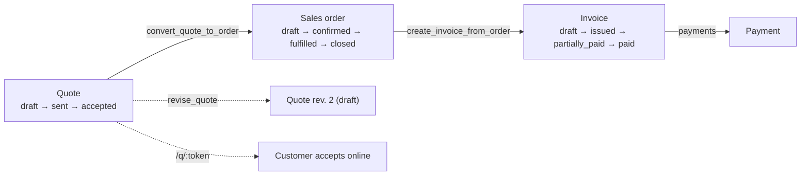

# Sales & billing

The commerce wave from [ARCHITECTURE_REVIEW.md](ARCHITECTURE_REVIEW.md) §14 Phase 6:
a **quote → sales order → invoice → payment** chain built on the platform
horizontals that already existed (numbering, audit, the country/tax engine, the
capability-URL pattern) rather than beside them.

Two modules own it, split the way the catalog already described them:

| Module | Tables | Routes |
|---|---|---|
| `sales` (requires `customers`) | `products`, `quotes`, `quote_lines`, `sales_orders`, `sales_order_lines`, `sales_settings` | `/sales` (hub: overview · quotes · orders · catalog · settings) |
| `billing` (requires `sales`) | `invoices`, `invoice_lines`, `payments` | the `/sales/invoices` tab inside the same hub |

Both ship `status: "available"` but are **not** in `DEFAULT_MODULES` — a tenant
turns them on in **Settings → Modules**, the same as speed limiters. `billing`
auto-enables `sales`, which auto-enables `customers`.

## The chain



Each arrow between documents is **one RPC, one transaction** — copying a dozen
lines with a dozen round trips is how half-converted documents get created:

| RPC | Guard | Result |
|---|---|---|
| `convert_quote_to_order(quote)` | quote must be `accepted` and unconverted (also a partial unique index on `sales_orders.quote_id`) | draft order + copied lines, `quotes.sales_order_id` linked |
| `create_invoice_from_order(order, lines?)` | order must be `confirmed` or `fulfilled`; requested quantities must not exceed what is left | draft invoice + the requested quantities, due date from `payment_terms_days` |
| `revise_quote(quote)` | quote must not be `draft` | new draft at `revision + 1`, `revision_of` lineage kept |
| `create_invoice_from_certificates(certs[], description?, price?, tax?, product?)` | one customer, none already billed (`CERTS_MULTIPLE_CUSTOMERS`, `CERT_ALREADY_INVOICED`) | draft invoice + one line per certificate, plate and number on the line |
| `create_quote_from_certificates(certs[], description?, price?, tax?, product?)` | one customer (`CERTS_MULTIPLE_CUSTOMERS`); no already-quoted guard — a quote is a proposal, not a claim | draft quote + one line per certificate being renewed, validity from `quote_valid_days` |

## Four customer processes, one chain

Customers do not all buy the same way, so the chain is entered at whichever
point their process starts. `sales_orders.quote_id` and `invoices.sales_order_id`
are both nullable, which is what makes this possible without a second chain:

| # | Process | How it maps |
|---|---|---|
| 1 | Quote → PO → Invoice → Payment | quote accepted → `convert_quote_to_order` → record the customer's PO on the order → `create_invoice_from_order` |
| 2 | PO → Job → Invoice → Payment | order created directly (no quote), PO recorded on it, job done, invoice from the order |
| 3 | Job → Certificate → Quote → PO → Invoice | invoice/quote raised **from the job page**, which links the job and its certificate; the quote then converts as in 1 |
| 4 | Job → Invoice → Payment | invoice raised from the job page with no order at all |

### The customer's purchase order

Captured on the **sales order** (`customer_po_number`, `customer_po_date`,
`customer_po_url`), not in a table of its own: the order already is "the agreed
work" — lines, totals, tax, a state machine, `invoiced_total` — so several
invoices against one PO is partial invoicing of that order rather than a second
order-shaped entity kept in step with the first. An order carrying a PO number
is what "PO received" means.

The invoice **snapshots** `customer_po_number` rather than joining through the
order: an issued invoice must keep printing the PO it was raised against, and a
scenario-4 invoice has no order to join to.

### Linking documents to the work

`quotes`, `sales_orders` and `invoices` each carry nullable `job_id` and
`certificate_id`, and both conversion RPCs copy them forward — so a quote
raised from a job still knows that job after it becomes an order and then an
invoice. The job page raises a quote or an invoice directly, prefilled with the
customer and vehicle and linked at creation rather than after the fact.

One job per document *at the header*: here a job is one vehicle and one
certificate, which is what these four processes describe. The consolidated
documents — one quote, later one invoice, for a fleet's worth of renewals —
are the case that promoted the certificate link to the **line**:
`quote_lines`, `sales_order_lines` and `invoice_lines` all carry
`certificate_id` (with the line's existing `vehicle_id`), one certificate for
one vehicle per line, and the conversion RPCs carry it down the chain. See
**Billing certificates** below.

## Where the numbers come from

**The database owns every amount.** The client never writes `subtotal`, `total`,
`amount_paid` or `invoiced_total`; triggers recompute them from the lines and
payments. `src/lib/sales.ts` mirrors the arithmetic so the line editor can
preview a total before saving — if the rounding rule changes in one place it
must change in the other, and `src/lib/sales.test.ts` pins the shared cases.

Per line, each step rounded to the document's currency scale:

```
line_gross    = round(quantity × unit_price)
line_discount = round(line_gross × discount% / 100)
line_net      = line_gross − line_discount
line_tax      = round(line_net × tax% / 100)     ← tax on the NET, per line
line_total    = line_net + line_tax
```

### Currency scale

Amounts round to the **tenant's currency minor units**, not a hardcoded 2.
`tenants.currency_decimals` is derived from the country by
`app.country_currency_decimals()` (a trigger keeps it in sync) and mirrors
`getCountry(country).currencyDecimals` in `shared/countries.ts` — keep the two
maps in step. Each document **snapshots** `currency` + `currency_decimals` at
creation, so changing the tenant's country can never re-round an issued invoice.

This matters in the home market: an OMR line of 3 × 12.345 + 5% VAT is
`37.035 + 1.852 = 38.887`, not `37.04 + 1.85 = 38.89`.

## What the database enforces

The UI offers the legal moves; these guarantee them (same posture as
`app.enforce_job_transition` for speed-limiter jobs):

- **State machines** — `app.enforce_quote_transition` / `_order_ / _invoice_`.
  Illegal jumps raise `ILLEGAL_*_TRANSITION`; lifecycle timestamps (`sent_at`,
  `accepted_at`, `confirmed_at`, `issued_at`, …) are stamped server-side.
- **Lines follow the document** — `app.guard_line_editable` allows line writes
  only while the parent is `draft` (`DOC_NOT_EDITABLE`).
- **Issued documents are immutable** — `app.guard_doc_locked` permits only the
  columns that document's own lifecycle owns (`DOC_LOCKED`).
- **Nothing empty leaves draft** — `app.guard_doc_not_empty` (`EMPTY_DOCUMENT`).
- **Numbering survives** — only drafts (and canceled documents) can be deleted;
  everything else is canceled or voided (`DOC_NOT_DELETABLE`).
- **Payments can't exceed the balance**, and only apply to an issued invoice
  (`PAYMENT_EXCEEDS_BALANCE`, `INVOICE_NOT_PAYABLE`). `amount_paid` and the
  settled status are derived by `app.settle_invoice` in both directions —
  deleting a payment reopens the balance.
- **Customers with issued invoices can't be deleted** (`CUSTOMER_HAS_INVOICES`),
  extending the existing certificate/job guard.
- **A certificate is billed at most once** — `app.guard_line_certificate` /
  `app.guard_invoice_certificate` (`CERT_ALREADY_INVOICED`). Voided invoices
  release their certificates; drafts hold them.

Every code above is mapped to a localized message in `src/lib/db.ts`
(`errors.*`), so users never see raw PostgREST text.

## Derived, not stored

There is no scheduler yet (ARCHITECTURE_REVIEW §5-G), so two states are
computed at render from dates rather than written by a cron job:

- **Quote `expired`** — status `sent` and `valid_until` in the past.
- **Invoice `overdue`** — status `issued`/`partially_paid` and `due_date` past.

`effectiveQuoteStatus()` / `effectiveInvoiceStatus()` in `src/lib/sales.ts` are
the single implementation; lists, detail pages, the customer panel and the
public quote endpoint all go through them. A stored `expired` status still
exists for explicitly retiring a quote.

## Numbering

`app.next_sales_doc_number` allocates through the shared
`app.next_doc_number(tenant, doc_type)` counter — never `max()+1` — and formats
with the tenant's prefix from `sales_settings`: `QT-00001`, `SO-00001`,
`INV-00001`. Prefixes and defaults (quote validity, payment terms, default tax
rate, standard terms text) are admin-editable under **Sales → Settings**. A
blank default tax rate falls back to the country's VAT rate.

## The customer-facing quote

`quotes.public_token` is a capability URL, exactly like the certificate verify
link: unguessable uuid, no auth, service-role scoped to the rows behind that
token, whitelisted fields only.

- SPA page: `/q/:token` (public, its own chunk, en/ar + RTL).
- Worker: `worker/quotes.ts` — `GET /api/quotes/:token`,
  `POST /api/quotes/:token/accept`.
- **Drafts and canceled quotes return 404**, indistinguishable from a bad
  token: a customer must never see a quote that was never sent to them.
- Acceptance re-checks status and validity server-side and updates with
  `.eq("status", "sent")` in the predicate, so two simultaneous clicks can't
  both win.

## Surfaces

| Where | What |
|---|---|
| `/sales` | KPI tiles from the `sales_summary()` RPC (open pipeline, win rate, receivables, collected) + "needs attention": quotes expiring within 7 days, overdue invoices, orders ready to invoice |
| `/sales/quotes` · `/orders` · `/invoices` | `DataTable` + `listPage` + server-side search/status filters, one shared `DocumentListPage` |
| `…/:id` | `DocumentDetailShell`: details, inline line editor, totals, lifecycle actions |
| `…/:id/print` | The customer-facing document; print is the PDF path ("Save as PDF") |
| `/sales/catalog` | Reusable services/parts/fees that prefill document lines |
| Customer 360 | `CustomerSalesPanel` — open quotes, receivables, recent documents (lazy, `sales`-gated) |
| Command palette | Quotes and invoices searchable by document number or title |

KPI tiles never pull document tables into the browser — `sales_summary()` is one
RLS-scoped row computed in SQL.

## Progress billing — several invoices per order

One PO often becomes several invoices: a fleet order is "50 × installation"
and the dealer bills 20 vehicles this month and 30 next. The unit is therefore
**quantity per order line**, not whole lines — a whole line is just its full
quantity.

`invoice_lines.sales_order_line_id` records which order line each invoice line
bills, and `sales_order_line_balance(order)` derives ordered / invoiced /
remaining from those rows. **Derived, never stored**: a stored counter would
have to be corrected on every invoice insert, void, un-void and line delete,
and any missed path silently bills a customer twice. Voided invoices are
excluded (a void never happened); drafts *are* counted, so two people preparing
drafts cannot both claim the same quantity.

`create_invoice_from_order(order, lines?)` takes
`[{"line_id": …, "quantity": …}, …]`. **Passing nothing invoices everything
still uninvoiced** — which is what the single-argument call always meant; the
old behaviour of copying every line unconditionally was the defect, because
calling it twice produced two full invoices for the same work.

Guards, all checked before anything is written so a rejection leaves no
half-built invoice and no consumed document number:

- `INVOICE_EXCEEDS_ORDER` — asking for more than a line has left. Duplicate
  entries for one line are summed first, so two half-sized claims cannot slip
  past the check and together overdraw it.
- `NOTHING_TO_INVOICE` — the order is fully invoiced.

## Billing certificates — the consolidated renewal invoice

The dealer certifies fleets. A customer turns up with 10 or 100 vehicles, each
gets a renewed certificate, and the customer expects **one invoice with a line
per vehicle** naming the plate and the certificate number. The failure this
guards against is the quiet one: a certificate issued, no invoice raised, and
a payment that never arrives because nobody noticed.

**The link lives on the line.** `invoice_lines.certificate_id` (plus the line's
`vehicle_id`) says which certificate a line bills; `invoices.certificate_id`
stays for the single-document invoice the job page raises, and every tracking
query reads both. The description is a snapshot — `<service> · <plate> ·
<certificate number>` — so an issued invoice keeps printing the identifiers
even if the certificate row is later deleted (the FK goes null, the text
stays).

**One definition of "invoiced".** `app.certificate_invoice_id(cert)` is the
non-void invoice that bills a certificate, through either link; drafts count
(two people preparing drafts cannot both claim the same certificate — the rule
progress billing applies to order lines), voids never happened. Everything
reads through it:

| Surface | What it does |
|---|---|
| `billing_state(speed_limiter_certificates)` | PostgREST computed column — `unbilled · draft · invoiced · paid` — so the certificates list filters on it (`?billing=unbilled`) alongside its expiry chips and search |
| `certificate_billing_status(ids[])` | The invoice behind each certificate on a page (number, status, due date, balance); the client derives the badge, adding the invoice list's "overdue" overlay (`src/lib/certificateBilling.ts`, unit-tested) |
| `create_invoice_from_certificates(...)` | One RPC, one transaction: a draft invoice for one customer with a line per certificate. Every check runs before anything is written, so a rejection consumes no document number |
| `sales_report_certificates_pending_invoice(customer?)` | Live certificates with no invoice — the worklist behind the KPI, grouped per customer on `/sales/reports` with the invoice one click away |
| `sales_report_pipeline().certificates_pending_invoice`, `sales_summary().unbilled_certificates` | The count, on the reports page and the hub overview |

**Where the invoice is raised.** The certificates list (select → *Create
invoice*; the *Not invoiced* chip finds what is missing), the report the bulk
renewal finishes with (*Create an invoice for these N certificates*), a
customer's row on the reports worklist, and a vehicle's current certificate.
All open the same dialog (`InvoiceCertificatesModal`), which splits the
selection into billable / already on INV-x / other customer / no customer,
and — because a hundred-vehicle renewal never fits one page of a list —
offers the rest of that customer's uninvoiced certificates. After that it is
an ordinary draft: lines and prices are editable until it is issued.

**Jobs pending invoice** now treats a job as billed when *either* an invoice
names it *or* the certificate it produced is on an invoice line, so a job
billed through a consolidated invoice does not stay pending forever.

### Quoting renewals — before the work

The same shape, one step earlier. A customer's vehicles are coming up for
expiry; the dealer sends **one quote with a line per vehicle** naming the plate
and the certificate being renewed, in a few clicks: the certificates list
filtered to *Not quoted* (or the *Renewals to quote* worklist on
`/sales/reports`, per customer) → select → *Create quote* → the same dialog,
with **Mark as sent and copy the customer link** so the quote goes out in the
same step, the link the customer accepts from ready to paste.

- **The link rides the chain.** `quote_lines.certificate_id` names the
  certificate being renewed; `convert_quote_to_order` copies it to the order
  line; `create_invoice_from_order` resolves it through `app.certificate_head`
  to the certificate the vehicle carries *by then* — the renewal, if the work
  is done — so the invoice bills the right document and the tracking below
  moves with it. `revise_quote` keeps the links too.
- **Two more states in front of "unbilled".** `app.certificate_quote_id` (an
  open quote: draft, sent or accepted, through the line or the header link)
  and `app.certificate_order_id` (a non-canceled order) make a certificate
  *quoted* or *ordered*; an invoice always wins. A declined, expired or
  canceled quote frees the certificate to be quoted again — the database
  never refuses a second quote, the dialog only tells the operator about the
  open one. `certificate_quote_status(ids[])` returns both for a page.
- **The worklist and the KPI.** `sales_report_renewals_to_quote(days, customer?)`
  is every live certificate expiring within the window (or already expired)
  with no quote, order or invoice; `renewals_to_quote` on the pipeline row and
  on `sales_summary()` is its count. The certificates list's chips map onto
  the computed column: *Not quoted* (`unbilled`) · *Quoted* (`quoted`,
  `ordered`) · *Not invoiced* (all three) · *Invoiced* · *Paid*.

## Reporting

`/sales/reports` (billing-gated). Four RLS-scoped SQL functions, same posture
as `sales_summary()` — the browser never pulls the document tables down to add
them up:

| Function | Answers |
|---|---|
| `sales_report_pipeline()` | One row of counts + values: pending / approved / rejected quotations, POs received, jobs pending invoice, invoices generated, partially paid, fully paid, outstanding, overdue |
| `sales_report_receivables()` | Per customer: open invoices, outstanding, and the aging buckets |
| `sales_report_revenue(p_months)` | Per month: invoiced, collected, invoice count |
| `sales_report_jobs_pending_invoice()` | The list behind the pending-invoice count, so it can be acted on |
| `sales_report_certificates_pending_invoice(customer?)` | Live certificates with no invoice — per customer on the page, with *Create invoice* beside each |
| `sales_report_renewals_to_quote(days, customer?)` | Live certificates expiring within the window with no quote, order or invoice — per customer, with *Create quote* beside each |
| `sales_report_payments(customer?, limit)` | Customer payment history — every receipt across invoices, filterable to one customer |

Four rather than thirteen, because most of the requested reports are different
readings of the same two questions — where a document is in its lifecycle, and
who owes what — and thirteen functions would be thirteen chances for the
definitions to drift. **Invoice aging and outstanding-balance-by-customer are
the same query**: the page sums the receivable columns for the aging totals
rather than asking twice, so the two can never disagree about what "31–60
days" means.

Definitions worth knowing, since they are judgement calls:

- **Aging is measured from the due date**, not the issue date. An invoice on
  60-day terms issued 45 days ago is not overdue.
- **Pending quotations include sent-but-lapsed ones.** `expired` is derived at
  render from `valid_until`, and a lapsed quote is still work someone has to
  chase, not a closed case.
- **Drafts and voids are excluded** from every money figure: a draft is not an
  invoice yet, and a void never happened.
- **A "PO received"** is a non-canceled order carrying `customer_po_number`.
- **The payment ledger is the one place voided invoices are NOT excluded.**
  Money that changed hands stays in the history even if the invoice it was
  applied to was later voided — hiding it would make the ledger disagree with
  the bank statement.
- **"Jobs pending invoice"** matches on `invoices.job_id`, which the whole
  chain carries — so a job billed through a quote and an order still counts as
  billed — and on the job's certificate being on an invoice line, so a job
  billed through a consolidated certificate invoice counts too.
- **"Certificates pending invoice"** are *live* certificates (the one a vehicle
  carries, not revoked) with no non-void invoice through either link. A
  superseded certificate that was never billed is history, not work: the
  renewal that replaced it is what is billable now.
- **"Renewals to quote"** are live certificates expiring within 90 days — or
  already expired, which need it most — with no open quote, live order or
  invoice. Ninety days is the certificates list's own outer band.

## Known gaps

Deliberately out of scope for this wave, in rough priority order:

- **No email.** Sharing a quote is a copy-the-link action; "mark as sent" is a
  manual status change. Wire both into the Phase-4 email service.
- **No credit notes.** A `paid` invoice is terminal by design; correcting one
  needs a credit note, which does not exist yet.
- **The reports are read-only, and only bounded where they must be.**
  Receivables and revenue are naturally bounded (one row per customer, per
  month); the jobs-pending-invoice list is capped at 50 rows in the UI with the
  true total beside it, and the payment ledger at 200 receipts. Neither is an
  export — CSV/statement output is not built.
- **Native `<select>` pickers** capped at 200 rows for customers, vehicles and
  catalog items — they inherit the platform-wide async-combobox debt
  (ARCHITECTURE_REVIEW §7.6), not a new one.
- **Module enablement is still client-side only** (§5-B) — these tables carry
  the standard tenant+role RLS, but no `app.module_enabled()` check yet.
