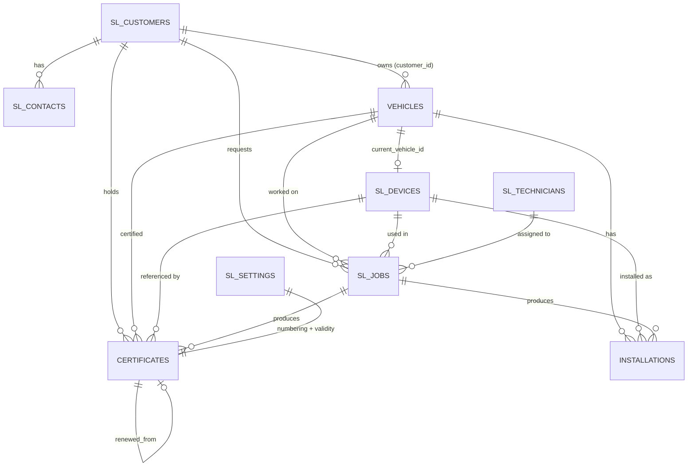
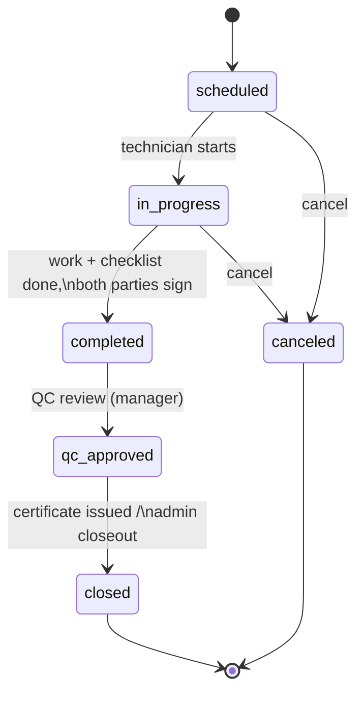
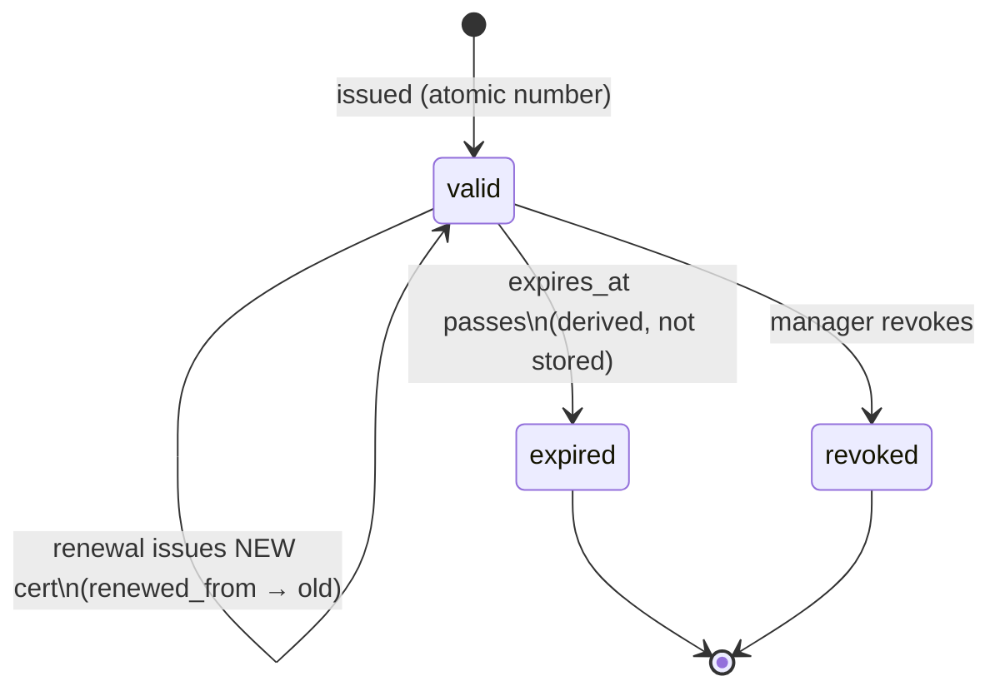

# Speed Limiter Module — Service-Provider Suite

The Speed Limiter module turns FleetManage into an operations platform for **speed
limiter service providers**: companies that install, inspect, and maintain speed
limiting devices on other organizations' vehicles and issue compliance certificates
that authorities (and anyone else) can verify publicly via QR code.

This document is the guide for developers and stakeholders: the business model, the
entity map, the job workflow state machine and its side-effects, the certificate
lifecycle, and what is deliberately out of scope.

## Business model

The **tenant is the service provider**, not the fleet owner. A typical tenant is a
company authorized to install speed limiters in its country. Its customers are
**client organizations** — logistics companies, school-bus operators, government
fleets — each with many vehicles that need a limiter installed and periodically
re-certified.

Day-to-day operations look like this:

1. A customer (client organization) brings vehicles in, or requests on-site work.
2. The provider schedules a **job** (installation, inspection, maintenance, removal,
   replacement, or emergency) assigning a **technician** and, where relevant, a
   **device** from stock.
3. The technician executes the job against a checklist; both parties sign off.
4. QC reviews and approves completed work.
5. For jobs that warrant it, the provider issues a **certificate** with an atomic
   sequential number, a validity window, and a QR code pointing at the public
   verification endpoint.
6. Traffic authorities, insurers, or the customer scan the QR to confirm the
   certificate is genuine, current, and matches the vehicle.

All of this is multi-tenant: every table carries `tenant_id` (defaulted from the
JWT — the client never sends it), RLS lets members read and managers write, and the
public verify endpoint is the single deliberate exception (read-only, by certificate
UUID, via the Worker).

## Entity map

| Entity | Table | Purpose | Key relationships |
|---|---|---|---|
| Customer | `sl_customers` | Client organization: name, CR/tax numbers, billing terms, credit limit, active/inactive status | Parent of contacts, vehicles, jobs, certificates |
| Contact | `sl_contacts` | Person at a customer (title, department, email/phone/WhatsApp, `is_primary`) | `customer_id` → customer |
| Vehicle | `vehicles` (extended) | Fleet-core vehicle, extended with `customer_id`, `chassis_number`, `fleet_number` so provider tenants can track customer-owned vehicles | `customer_id` → customer |
| Device | `sl_devices` | Physical limiter unit: serial, manufacturer/model, firmware, IMEI, purchase and warranty data; status `in_stock` \| `installed` \| `faulty` \| `retired`; `current_vehicle_id` when installed | Tracked through jobs and installations |
| Technician | `sl_technicians` | Installer/inspector on staff (name, phone, email, active flag) | Assigned to jobs via `technician_id` |
| Job | `sl_jobs` | The unit of work — see the state machine below. `number` is assigned by a DB trigger (never sent by the client); carries checklist, signatures, QC fields, timing | `customer_id`, `vehicle_id`, `device_id`, `technician_id` |
| Installation | `speed_limiter_installations` | Historical record that a device was installed on a vehicle at a set speed, extended with `customer_id`, `device_id`, `job_id` | Links vehicle ↔ device ↔ job |
| Certificate | `speed_limiter_certificates` | The compliance document — see the lifecycle below | `customer_id`, `vehicle_id`, `device_id`, `job_id`, `installation_id`, `renewed_from` |
| Settings | `sl_settings` | Per-tenant certificate policy: `cert_prefix`, `cert_next_number`, `cert_validity_months` | Read by the numbering RPC and issuance flow |

## Job workflow state machine

- **scheduled** — job created with type, customer, vehicle, optional device,
  technician, and date. The DB trigger assigns the sequential job `number`.
- **in_progress** — technician started (`started_at` stamped).
- **completed** — checklist finished, `completed_at` and `duration_minutes`
  recorded, `technician_signed` and `customer_signed` captured.
- **qc_approved** — a manager reviews and approves (`qc_by`, `qc_at`). This is the
  quality gate before any certificate is issued.
- **closed** — terminal. Paperwork done; certificate issued where applicable.
- **canceled** — terminal escape hatch from `scheduled` or `in_progress`. Canceling
  never mutates device or installation state (side-effects only fire on completion).

### Side-effects per job type

Side-effects run when the job completes (device/installation bookkeeping) and are
finalized through QC:

| Job type | Device effect | Installation effect | Certificate |
|---|---|---|---|
| `installation` | Device → `installed`, `current_vehicle_id` = job's vehicle | New installation row (vehicle, device, set speed, technician, job) | Issued after QC |
| `replacement` | Old device → back to `in_stock` (or `faulty`); new device → `installed` on the vehicle | New installation row for the new device | Issued after QC (supersedes prior) |
| `removal` | Device → `in_stock`, `current_vehicle_id` cleared | Installation marked removed | None (existing certificate typically revoked) |
| `inspection` | None (unless found `faulty`) | None | Renewal certificate after QC |
| `maintenance` | Possibly `faulty` ↔ `installed` transitions | None | None by default |
| `emergency` | Case-by-case (as above, per what was actually done) | Case-by-case | Case-by-case |

## Certificate lifecycle

- **Issuance** — created from a QC-approved job. The certificate number comes from
  `supabase.rpc("next_certificate_number")`, which atomically increments
  `sl_settings.cert_next_number` and returns the formatted number (e.g.
  `SLC-00001` using `cert_prefix`). Call it **exactly once per issued certificate,
  at insert time** — never preview it, never reuse it. `expires_at` is
  `issued_at + sl_settings.cert_validity_months`. The row links customer, vehicle,
  device, job, installation, and the certified `set_speed_kmh`.
- **Expiry** — derived from `expires_at` at read time; there is no stored
  `expired` status. UI shows *expiring soon* / *expired* badges from the date.
- **Renewal** — an inspection job that passes QC issues a **new** certificate with
  `renewed_from` pointing at the previous one, forming an auditable chain. Old
  certificates are never edited in place.
- **Revocation** — a manager sets `status = "revoked"` with `revoked_at` and
  `revoked_reason` (device removed, tampering found, issued in error). Revocation
  is a stored status and wins over dates on the verify endpoint.
- **Print + QR** — `/speed-limiters/certificates/:id/print` renders the printable
  certificate with a QR code (via the `qrcode` package) encoding
  `<origin>/verify?c=<certUuid>`.
- **Public verification** — the SPA page `/verify?c=<uuid>` calls the Worker's
  public `GET /api/verify/:certUuid`, which returns
  `{ status: "valid" | "expired" | "revoked" | "not_found", certificateNumber, issuedAt, expiresAt, setSpeedKmh, issuingAuthority, vehiclePlate, vehicleName, customerName, issuedBy }`.
  No authentication required; the certificate UUID is the capability. Nothing
  beyond that response is exposed.

## Deliberately out of scope

To keep this module honest and focused, the following are **deferred to other
catalog modules** rather than half-built here:

| Concern | Belongs to |
|---|---|
| Invoicing, quotes, payments for jobs/certificates | **Finance** module |
| Purchase orders, supplier management, stock replenishment for devices | **Inventory** module |
| Customer self-service logins (view own vehicles/certificates) | **Customer Portal** module |
| SMS/WhatsApp reminders for expiring certificates and scheduled jobs | **Notifications** module |
| Technician mobile app (offline checklists, photo capture, GPS) | **Mobile Workforce** module |

The schema anticipates these (e.g. `billing_terms`/`credit_limit` on customers,
purchase data on devices, WhatsApp on contacts) so enabling those modules later is
additive, not a migration.

## Where things live

- Types: `src/lib/types.ts` (`SlCustomer`, `SlContact`, `SlDevice`, `SlTechnician`,
  `SlJob`, `SlSettings`, extended `Vehicle`, `SpeedLimiterInstallation`,
  `SpeedLimiterCertificate`)
- Pages: `src/pages/speed-limiters/` (hub + Customers, Devices, Jobs, Certificates,
  detail and print pages); public verify page at `/verify`
- Worker: public `GET /api/verify/:certUuid`
- DB: `supabase/migrations` (tables, RLS, job-number trigger,
  `next_certificate_number()` RPC)
- i18n namespaces: `speedLimiters` (hub + shared enums), `slCustomers`,
  `slDevices`, `slJobs`, `slCertificates` — English + Arabic, RTL-ready
