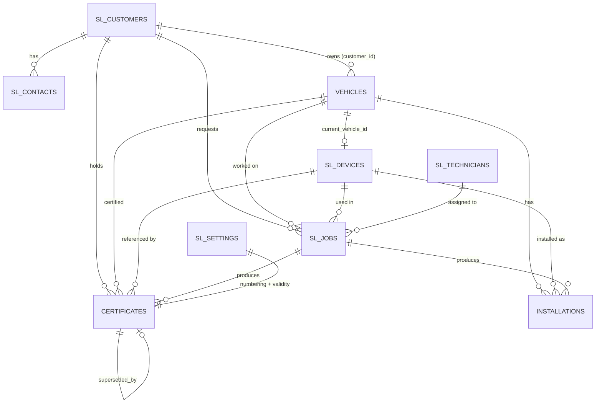
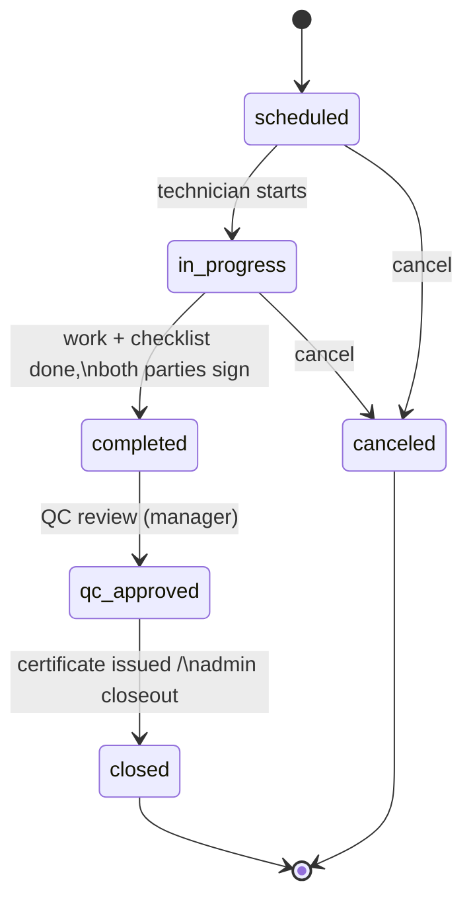
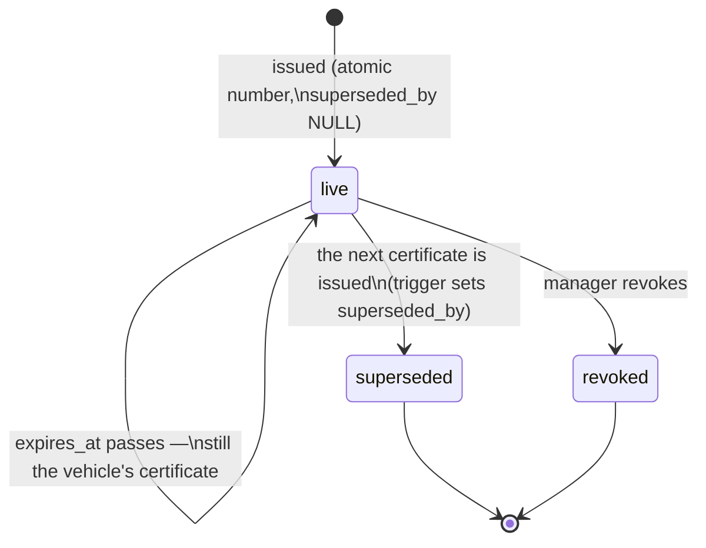

# Speed Limiter Module — Service-Provider Suite

The Speed Limiter module turns FleetManage into an operations platform for **speed
limiter service providers**: companies that install, inspect, and maintain speed
limiting devices on other organizations' vehicles and issue compliance certificates
that authorities (and anyone else) can verify publicly via QR code.

This document is the guide for developers and stakeholders: the business model, the
entity map, the job workflow state machine and its side-effects, the certificate
lifecycle, and what is deliberately out of scope.

## Business model

The **tenant is the service provider**, not the fleet owner. A typical tenant is a
company authorized to install speed limiters in its country. Its customers are
**client organizations** — logistics companies, school-bus operators, government
fleets — each with many vehicles that need a limiter installed and periodically
re-certified.

Day-to-day operations look like this:

1. A customer (client organization) brings vehicles in, or requests on-site work.
2. The provider schedules a **job** (installation, inspection, maintenance, removal,
   replacement, or emergency) assigning a **technician** and, where relevant, a
   **device** from stock.
3. The technician executes the job against a checklist; both parties sign off.
4. QC reviews and approves completed work.
5. For jobs that warrant it, the provider issues a **certificate** with an atomic
   sequential number, a validity window, and a QR code pointing at the public
   verification endpoint.
6. Traffic authorities, insurers, or the customer scan the QR to confirm the
   certificate is genuine, current, and matches the vehicle.

All of this is multi-tenant: every table carries `tenant_id` (defaulted from the
JWT — the client never sends it), RLS lets members read and managers write, and the
public verify endpoint is the single deliberate exception (read-only, by certificate
UUID, via the Worker).

## Entity map


```mermaid
erDiagram
    SL_CUSTOMERS ||--o{ SL_CONTACTS : "has"
    SL_CUSTOMERS ||--o{ VEHICLES : "owns (customer_id)"
    SL_CUSTOMERS ||--o{ SL_JOBS : "requests"
    SL_CUSTOMERS ||--o{ CERTIFICATES : "holds"
    VEHICLES ||--o{ SL_JOBS : "worked on"
    VEHICLES ||--o| SL_DEVICES : "current_vehicle_id"
    VEHICLES ||--o{ INSTALLATIONS : "has"
    VEHICLES ||--o{ CERTIFICATES : "certified"
    SL_DEVICES ||--o{ SL_JOBS : "used in"
    SL_DEVICES ||--o{ INSTALLATIONS : "installed as"
    SL_DEVICES ||--o{ CERTIFICATES : "referenced by"
    SL_TECHNICIANS ||--o{ SL_JOBS : "assigned to"
    SL_JOBS ||--o{ INSTALLATIONS : "produces"
    SL_JOBS ||--o{ CERTIFICATES : "produces"
    CERTIFICATES ||--o| CERTIFICATES : "renewed_from"
    CERTIFICATES ||--o| CERTIFICATES : "superseded_by"
    SL_SETTINGS ||--|| CERTIFICATES : "numbering + validity"
```

| Entity | Table | Purpose | Key relationships |
|---|---|---|---|
| Customer | `customers` (**global** — owned by the `customers` master-data module, which this module requires) | Client organization: name, CR/tax numbers, billing terms, credit limit, active/inactive status | Parent of contacts, vehicles, jobs, certificates |
| Contact | `contacts` (**global**, with customers) | Person at a customer (title, department, email/phone/WhatsApp, `is_primary`) | `customer_id` → customer |
| Vehicle | `vehicles` (extended) | Fleet-core vehicle with a first-class `ownership` (`company` \| `customer`) plus `customer_id`, `chassis_number`, `fleet_number` so provider tenants track customer-owned vehicles distinctly from their own fleet | `customer_id` → customer |
| Device | `sl_devices` | Physical limiter unit: serial, manufacturer/model, firmware, IMEI, purchase and warranty data; status `in_stock` \| `installed` \| `faulty` \| `retired`; `current_vehicle_id` when installed | Tracked through jobs and installations |
| Technician | `sl_technicians` | Installer/inspector on staff (name, phone, email, active flag) | Assigned to jobs via `technician_id` |
| Job | `sl_jobs` | The unit of work — see the state machine below. `number` is assigned by a DB trigger (never sent by the client); carries checklist, signatures, QC fields, timing | `customer_id`, `vehicle_id`, `device_id`, `technician_id` |
| Installation | `speed_limiter_installations` | Historical record that a device was installed on a vehicle at a set speed, extended with `customer_id`, `device_id`, `job_id` | Links vehicle ↔ device ↔ job |
| Certificate | `speed_limiter_certificates` | The compliance document — see the lifecycle below | `customer_id`, `vehicle_id`, `device_id`, `job_id`, `installation_id`, `renewed_from`, `superseded_by` |
| Settings | `sl_settings` | Per-tenant certificate policy: `cert_prefix`, `cert_next_number`, `cert_validity_months` | Read by the numbering RPC and issuance flow |

## Job workflow state machine


```mermaid
stateDiagram-v2
    [*] --> scheduled
    scheduled --> in_progress : technician starts
    in_progress --> completed : work + checklist done,\nboth parties sign
    completed --> qc_approved : QC review (manager)
    qc_approved --> closed : certificate issued /\nadmin closeout
    scheduled --> canceled : cancel
    in_progress --> canceled : cancel
    closed --> [*]
    canceled --> [*]
```

- **scheduled** — job created with type, customer, vehicle, optional device,
  technician, and date. The DB trigger assigns the sequential job `number`.
- **in_progress** — technician started (`started_at` stamped).
- **completed** — checklist finished, `completed_at` and `duration_minutes`
  recorded, `technician_signed` and `customer_signed` captured.
- **qc_approved** — a manager reviews and approves (`qc_by`, `qc_at`). This is the
  quality gate before any certificate is issued.
- **closed** — terminal. Paperwork done; certificate issued where applicable.
- **canceled** — terminal escape hatch from `scheduled` or `in_progress`. Canceling
  never mutates device or installation state (side-effects only fire on completion).

### Side-effects per job type

Side-effects run when the job completes (device/installation bookkeeping) and are
finalized through QC:

| Job type | Device effect | Installation effect | Certificate |
|---|---|---|---|
| `installation` | Device → `installed`, `current_vehicle_id` = job's vehicle | New installation row (vehicle, device, set speed, technician, job) | Issued after QC |
| `replacement` | Old device → back to `in_stock` (or `faulty`); new device → `installed` on the vehicle | New installation row for the new device | Issued after QC (supersedes prior) |
| `removal` | Device → `in_stock`, `current_vehicle_id` cleared | Installation marked removed | None (existing certificate typically revoked) |
| `inspection` | None (unless found `faulty`) | None | Renewal certificate after QC |
| `maintenance` | Possibly `faulty` ↔ `installed` transitions | None | None by default |
| `emergency` | Case-by-case (as above, per what was actually done) | Case-by-case | Case-by-case |

## Certificate lifecycle


```mermaid
stateDiagram-v2
    [*] --> live : issued (atomic number,\nsuperseded_by NULL)
    live --> live : expires_at passes —\nstill the vehicle's certificate
    live --> superseded : the next certificate is issued\n(trigger sets superseded_by)
    live --> revoked : manager revokes
    superseded --> [*]
    revoked --> [*]
```

- **Issuance** — created from a QC-approved job, or from the renewal flow. The
  certificate number comes from `supabase.rpc("next_certificate_number")`, which
  atomically increments `sl_settings.cert_next_number` and returns the formatted
  number (e.g. `SLC-00001` using `cert_prefix`). Call it **exactly once per issued
  certificate, at insert time** — never preview it, never reuse it. `expires_at`
  is `issued_at + sl_settings.cert_validity_months`. The row links customer,
  vehicle, device, job, installation, and the certified `set_speed_kmh`.
- **Expiry** — derived from `expires_at` at read time; there is no stored
  `expired` status, and expiring does **not** change which certificate a vehicle
  carries. A tenant that back-loaded its paper register holds hundreds of live,
  long-expired certificates: that is the renewal backlog, not corrupt data, and
  it is never hidden or deleted.
- **Supersession** — issuing the next certificate for the same vehicle sets
  `superseded_by` on the previous one. This is the *only* answer to "which
  certificate does this vehicle carry"; see below.
- **Renewal** — an inspection job that passes QC, or the renewal modal, issues a
  **new** certificate with `renewed_from` pointing at the row the operator acted
  on. Old certificates are never edited in place.
- **Revocation** — a manager sets `status = "revoked"` with `revoked_at` and
  `revoked_reason` (device removed, tampering found, issued in error). Revocation
  is a stored status and wins over dates on the verify endpoint.
- **Print + QR** — `/speed-limiters/certificates/:id/print` renders the printable
  certificate with a QR code (via the `qrcode` package) encoding
  `<origin>/verify?c=<certUuid>`. See **The printed certificate** below.
- **Public verification** — the SPA page `/verify?c=<uuid>` calls the Worker's
  public `GET /api/verify/:certUuid`, which returns
  `{ status: "valid" | "expired" | "revoked" | "not_found", certificateNumber, uin, issuedAt, expiresAt, setSpeedKmh, setSpeedSecondaryKmh, issuingAuthority, vehiclePlate, vehicleName, customerName, issuedBy }`.
  No authentication required; the certificate UUID is the capability. Nothing
  beyond that response is exposed. It deliberately does **not** consult
  `superseded_by`: it answers about the document in the inspector's hand, from
  that document's own dates and status. A superseded certificate still verifies
  as `expired` (or `valid`, if a renewal was issued early) — printed certificates
  already depend on this response shape, so it does not grow a fourth status.

### Supersession — which certificate a vehicle carries

A vehicle legally carries **one live RSL certificate at a time**, and
`speed_limiter_certificates.superseded_by` is the column that says which.
It points at the certificate that *immediately* replaced this one, so a
vehicle's certificates form a linked list ending at the live head:

```
oldest → … → previous → newest   (newest.superseded_by IS NULL)
```

`superseded_by IS NULL` therefore means "this is the vehicle's current
certificate". It is a linked list rather than "every historical row points at
the head" on purpose: the FK is `ON DELETE SET NULL`, so deleting the head
resurrects exactly **one** predecessor instead of resurrecting a dozen and
leaving the vehicle with a dozen live certificates.

**Keyed on `vehicle_id`, never `installation_id`.** Real renewal chains cross
installations: an imported paper register mints one installation row per
register entry, so in the reference tenant (GAWHRAT, 492 certificates over 477
vehicles) **9 of the 15** `renewed_from` chains point at a predecessor with a
*different* `installation_id`. The installation is bookkeeping about the fitted
device; the certificate is a document about the vehicle. Group by the vehicle.

**Not the same thing as `renewed_from`.** That column records only the row an
operator pressed Renew on. It is NULL for every imported historical certificate
(15 of 492 rows carry it), it is a hint rather than an invariant, and nothing
maintains it. Never query it to decide what is live.

The trigger — `app.sync_certificate_supersession()`, `after insert or delete
for each row`, `security definer` with `search_path = ''` and every statement
pinned to the row's own `tenant_id`:

| Path | What it does |
|---|---|
| Ordering | Siblings rank by `(issued_at, created_at, id)`. `id` is a uuid PK, so the order is **total** — two certificates issued the same day for one vehicle can never both be newest. `superseded_by` always points strictly *up* that order, which makes cycles structurally impossible. |
| INSERT | Finds the immediate predecessor (newest sibling ranking older) and points it at the new row. Also finds the immediate successor (oldest sibling ranking *newer*): when one exists the new row is back-dated — a historical import or a correction — so it is born superseded and the live head is left alone. |
| DELETE | Splices the list: the predecessor is relinked onto the deleted row's own successor, so removing a row from the *middle* cannot leave two live certificates. The FK's `ON DELETE SET NULL` already covers deleting the head. |
| Concurrency | `pg_advisory_xact_lock` on (tenant, vehicle) serializes issuance per vehicle. Without it two simultaneous renewals each see no sibling and both stay live — not hypothetical, the reference tenant already carries a double-submit pair. |
| No UPDATE path | The only update the app performs on an issued certificate is revocation, which is orthogonal to ordering. If `issued_at` or `vehicle_id` ever become editable, the trigger must grow an `after update` path that repairs **both** the vacated position and the new one. |

Backfill was one `lag()` statement over the newest-first window partitioned by
`(tenant_id, vehicle_id)` — the same rule the trigger applies, so history and
future rows agree. Two partial indexes back it: `sl_certificates_live_expiry_idx
(tenant_id, expires_at) WHERE superseded_by IS NULL` for the hot "live
certificates by expiry" query, and `sl_certificates_superseded_by_idx` so a
certificate DELETE does not seq-scan to apply the FK action.

**The predicate every query must use.** Supersession and revocation are separate
axes and are never folded together — a revoked head means the vehicle has no
valid certificate, it does not resurrect the predecessor:

```ts
live        → .is("superseded_by", null).eq("status", "valid")
superseded  → .not("superseded_by", "is", null)
revoked     → .eq("status", "revoked")
```

"Live" says nothing about expiry. `src/lib/certificateStatus.ts` mirrors these
predicates client-side (`isLiveCertificate`, `isSupersededCertificate`) so a
count computed in the browser can never disagree with a paginated server query,
and it is where every surface gets its badge from.

### Status buckets

One bucket per certificate, first match wins (`certificateBucket`):

| Bucket | Test | Badge |
|---|---|---|
| `revoked` | `status = "revoked"` | slate |
| `superseded` | `superseded_by IS NOT NULL` | slate |
| `expired` | days < 0 | red |
| `d30` | 0 ≤ days ≤ 30 | red |
| `d60` | 31–60 | yellow |
| `d90` | 61–90 | blue |
| `ok` | > 90 | green |

Revocation outranks everything: an explicit act by the issuer beats any date.
**Supersession is checked before expiry** — a renewed-then-lapsed certificate
reads *Superseded*, not *Expired*, because it is history, not work, and a red
badge there sends a technician out to renew a vehicle that is already compliant.
Superseded is slate for the same reason; red is reserved for states that need
someone to act. Days are whole days from today and a certificate is still good
on its expiry date, so `days = 0` lands in `d30`, not `expired`.

### Renewing a certificate

`src/pages/speed-limiters/RenewCertificateModal.tsx` is the one implementation.
Every surface mounts the same component, driven by a certificate id; it fetches
the joined row it needs itself, so a caller that holds only an id (or an
unjoined row) is safe.

| Surface | Entry point |
|---|---|
| Certificates list | Row *Renew* icon; **Renew selected** over the `DataTable` selection for a customer who turns up with five vehicles |
| Vehicle detail | Header *Renew certificate* button, plus *Renew* on the current-certificate card — shown only when the vehicle has a live head |
| Customer detail | Row *Renew* icon in the vehicles card, shown when that vehicle's head is expired or inside the 90-day window |

**The invariant: one certificate, one number, one RPC call.**
`renewCertificate()` calls `next_certificate_number()` exactly once, at insert
time. A number fetched early and then not used burns a number; a number reused
across two inserts collides. Bulk renewal therefore runs **strictly
sequentially** — awaited one row at a time, never `Promise.all` — and never
rolls back: rows that succeeded stay issued, and the summary names every success
and every failure rather than reporting one verdict for the batch. The bulk form
lists what it will skip before it starts: revoked certificates (replaced by a
new job, not renewed) and rows that are already superseded.

A renewal carries forward customer, vehicle, device, installation, tamper seal,
limiter type and the UIN (`resolveUin` — reprint what the installation carries,
derive only when it has none, and write the derived one back so later renewals
reprint it), and sets `renewed_from` to the row it replaced. The operator may
change issuing authority, both set speeds, and the two dates (defaulted to today
and today + `cert_validity_months`). The client never writes `superseded_by` —
the trigger maintains both directions from the insert alone.

### The actionable window

"Due soon" is bounded on **both** sides: `expires_at` between today − 30 and
today + 60, ordered ascending, limited to a handful. The lower bound is the
whole point. With an upper bound only, an ascending order returns the *oldest*
rows in the tenant rather than the nearest ones — in the reference tenant that
pinned four 2022 certificates to the context panel forever while the three
genuinely due sat hundreds of rows behind them.

What the window excludes is **counted, not hidden**: head-only `countRows`
queries for the live-and-lapsed backlog render as a link into
`/speed-limiters/certificates?filter=expired`, and "Nothing due" appears only
when the window *and* the backlogs are empty. The same rule governs the overview
expiry board — four buckets, each a `listPage(0, 5)` so the chip shows the exact
server-side total while only five rows travel, each card linking to the
certificates list chip of the same name.

That link works because the certificates list keeps its state in the URL
(`?filter=&q=&page=`), which also makes "these are due" shareable and
back-button-friendly. Its search covers certificate number, UIN and tamper seal
plus the vehicle (name, plate, chassis, VIN) — PostgREST cannot OR a parent
column against an embedded resource, so matching vehicles are resolved first and
folded in as a capped id set, and hitting the cap is surfaced rather than
silently dropping rows. The default view is live-only; when a search comes up
empty there, superseded matches are counted and offered behind a link, so a
technician typing an old certificate number never reads "no record of it".

## The printed certificate

The print page reproduces the **Omani dealer format** — the layout every
authorized dealer in Oman files with the ROP — rather than a house style, so a
tenant can hand the generated page to a customer or an inspector unchanged. It
fits one A4 page at the reference's own metrics (20 px single-line table rows,
four-column body tables) and mirrors cleanly under Arabic.

Top to bottom: the bilingual masthead (`tenants.name_ar` over `tenants.name`,
in the letterhead blue), Installation/Renewal, the reference row with the
certificate number and country, the black-bannered DECLARATION, and the
VEHICLE / SPEED LIMITER / DEALER tables, then the UIN + validity row, the
QR + signature + stamp strip, and the flag-colored footer.

Four fields exist only for this document:

| Field | Lives on | Why |
|---|---|---|
| `uin` | `sl_jobs` → `speed_limiter_installations` → `speed_limiter_certificates` | The number identifies the **fitted limiter**, so it is minted once and reprinted unchanged by every renewal. Format: `OM-<last 5 digits of the vehicle's chassis>-<document number>` — chassis `JHHLCK1F7PK026626` on certificate `GOM-WO-202601` gives `OM-26626-202601`. Letters in the chassis are skipped (the rule counts digits) and a short chassis is left-padded to five. Precedence at issuance: a number typed on the job wins, then the one the installation already carries, and only failing both is a new one derived — which is then **written back to the installation**, so the next renewal reprints it. A vehicle with no chassis has nothing to derive from and keeps whatever was recorded, rather than printing a malformed identifier. `app.build_uin` owns the format and `issue_certificate` the precedence; `buildUin` / `resolveUin` in `src/lib/certificate.ts` mirror both for the renewal modal, which inserts directly. The two must agree — certificates are issued through both paths. |
| `set_speed_secondary_kmh` | same three tables | Omani limiters are programmed with two bands and the document prints the pair — `70/90 KMPH`. One band still prints as a single number. |
| `limiter_type` | `sl_devices` → `speed_limiter_certificates` | "Electronic Pedal" is a property of the device, not of its brand/model. |
| letterhead block | `tenants` | `name_ar`, `cr_number`, `po_box`, `postal_code`, `city`/`city_ar`, `email`, `website`, `phone_secondary`, `services_line`/`services_line_ar`, `signature_url`, `stamp_url`, `signatory_name`/`signatory_name_ar` — edited under Settings → Organization → Document letterhead. The two mark URLs are constrained to `https:` / `data:image` in the database and validated in the form. `website` is deliberately unconstrained in the database — it is only ever printed as text, never dereferenced — but the form asks for the bare domain the dealer writes on the letterhead (`gawhrat.com`), since a pasted `https://…/path` would print in full. |

The **Installation / Renewal** heading comes from the job's `job_type`
(`installation` and `replacement` print Installation, everything else prints
Renewal), falling back to `renewed_from` only when a certificate has no job. A
renewal of a limiter fitted before the tenant kept records here — every
back-loaded register — has no predecessor certificate, and would otherwise
print as an Installation.

The footer registration line is **composed**, not stored: `registrationLine` in
`src/lib/certificate.ts` builds it from the block above and prints it twice —
Arabic with Arabic-Indic digits above English — on every copy regardless of the
UI language, which is why `translateIn(language, key)` exists in `src/i18n`. It
reads in document order: the registration identifiers, the locality, the
website, then **each contact number under its own label** (Service & Support,
Alternative Contact — the dealer names them separately, so they are not
slash-joined into one `GSM:` segment). Every field drops out *with* its label
when blank, so a partially configured tenant still prints a clean line. The
e-mail is not a segment: it prints on its own line below, as on the scanned
original.

Two conversions are deliberately asymmetric. Arabic-Indic digits are applied to
the identifiers, the locality and the phone numbers, but **never** to the
website or the e-mail — a domain is a machine-readable address, and `24auto.om`
rewritten as `٢٤auto.om` is unreachable.

Phone values are **bidi-pinned**, and it takes two fixes that only work
together (see the tests in `src/lib/certificate.test.ts`). `registrationLine`
returns a plain string, so `<bdi>` is unavailable: each number is wrapped in
U+2068 FSI … U+2069 PDI — without it the neutral leading `+` resolves against
the surrounding Arabic and migrates to the far end, printing `٩٦٨+` — and its
internal spaces are collapsed to U+00A0, because Arabic-Indic digits are bidi
class AN and an ordinary space between two AN runs resolves to R (rule N1),
splitting the number into chunks laid out right-to-left (`+٧٦٧٥ ٧٥٢١ ٩٦٨`).
U+00A0 is a common separator that rule W4 folds into the number. Callers must
render the returned string as-is — no `trim`, no whitespace normalisation.

The middle cell of the QR / signature / stamp strip carries the
**authorized-signatory block**: `For <trade name>` above the scanned signature
and `signatory_name` below it. A tenant with no signatory prints the mark alone
at full height, exactly as before; a tenant with a signatory but no mark gets
blank space to sign by hand. Dates on the document use `formatDocumentDate`
(DD-MM-YYYY, locale-independent) rather than `formatDate`.

One deliberate departure from the scanned reference: section spacing is uniform
(the original carries a stray empty paragraph under SPEED LIMITER DETAILS). The
document has no on-screen "generated by" notice of its own — the printed
document belongs to the dealer, and the QR already carries the verify URL; the
page chrome above the certificate (back link, copy-verify-link, print button)
is `print:hidden` and never reaches paper.

## Deliberately out of scope

To keep this module honest and focused, the following are **deferred to other
catalog modules** rather than half-built here:

| Concern | Belongs to |
|---|---|
| Customer & contact master data | **Customers** module (extracted 2026-07; this module consumes the global `customers`/`contacts` tables and requires the module) |
| Invoicing, quotes, payments for jobs/certificates | **Finance** module (will consume the same global customers) |
| Purchase orders, supplier management, stock replenishment for devices | **Inventory** module |
| Customer self-service logins (view own vehicles/certificates) | **Customer Portal** module |
| SMS/WhatsApp reminders for expiring certificates and scheduled jobs | **Notifications** module |
| Technician mobile app (offline checklists, photo capture, GPS) | **Mobile Workforce** module |

The schema anticipates these (e.g. `billing_terms`/`credit_limit` on customers,
purchase data on devices, WhatsApp on contacts) so enabling those modules later is
additive, not a migration.

## Where things live

- Types: `src/lib/types.ts` (`Customer`, `Contact` — global master data — plus
  `SlDevice`, `SlTechnician`, `SlJob`, `SlSettings`, extended `Vehicle` and
  `Tenant`, `SpeedLimiterInstallation`, `SpeedLimiterCertificate`)
- Document text rules: `src/lib/certificate.ts` (speed band, document date,
  Arabic-Indic digits, footer registration line) — unit-tested
- Status rules: `src/lib/certificateStatus.ts` (live predicate, buckets, badge
  meta, fleet compliance) — the single source every surface renders from,
  unit-tested in `certificateStatus.test.ts`
- Renewal: `src/pages/speed-limiters/RenewCertificateModal.tsx` — the modal plus
  `renewCertificate` / `fetchRenewSource` / `defaultRenewalDates`, mounted by the
  certificates list (single + bulk), vehicle detail and customer detail
- Pages: `src/pages/speed-limiters/` (hub + Devices, Jobs, Certificates, detail
  and print pages); customer pages live in the global `src/pages/customers/`
  (`/customers`, `/customers/:id`); public verify page at `/verify`
- Worker: public `GET /api/verify/:certUuid`
- DB: `supabase/migrations` (tables, RLS, job-number trigger,
  `next_certificate_number()` RPC; customers/contacts renamed global in
  `20260720000001_customers_extraction.sql`; `superseded_by` + its trigger,
  indexes and backfill in `20260728000001_certificate_supersession.sql`)
- i18n namespaces: `speedLimiters` (hub + shared enums), `customers` (global),
  `slDevices`, `slJobs`, `slCertificates` — English + Arabic, RTL-ready
